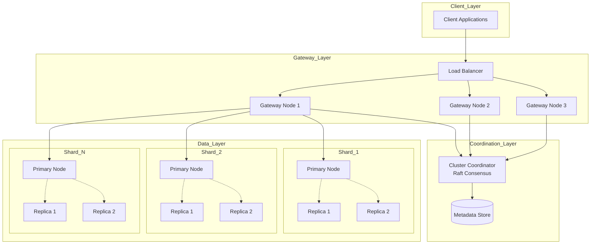

# RFC 002: Distributed Meilisearch Architecture

**Status:** Draft  
**Created:** 2025-11-10  
**Authors:** Meilisearch Community  
**Tracking Issue:** TBD

---

## Summary

This RFC proposes a distributed architecture for Meilisearch to enable horizontal scaling beyond single-node deployments. The design introduces shard allocation, consistent hashing for data distribution, query routing, and cluster coordination while maintaining Meilisearch's core principles of simplicity and performance.

## Motivation

### Current Limitations

Meilisearch's current architecture is **single-node only**, as documented in [`ARCHITECTURE_OVERVIEW.md`](ARCHITECTURE_OVERVIEW.md:559):

**Weaknesses:**
1. ❌ **Scalability:** Single-node architecture
2. ❌ **Write Throughput:** LMDB single-writer limitation
3. ❌ **Vector Search:** Limited ANN algorithms, no distribution

From [`blog_posts/01_meilisearch_architecture_deep_dive.md`](blog_posts/01_meilisearch_architecture_deep_dive.md:1123):

> **No Built-in Distributed System**
> 
> **Current State:** Meilisearch is **single-node only**
> 
> **When it matters:**
> - ❌ Horizontal scaling for massive datasets (>100M documents)
> - ❌ Geographic distribution for low latency
> - ✅ Vertical scaling works well up to billions of documents (with sufficient RAM)

### Real-World Use Cases

**Global E-Commerce Platform:**
- 500M+ products across multiple regions
- Single-node cannot fit entire dataset in memory
- **Need:** Geographic distribution with regional replicas

**Multi-Tenant SaaS:**
- 10,000+ tenant indexes
- Current LRU cache limited to ~20 indexes ([`index_mapper.rs`](crates/index-scheduler/src/index_mapper.rs:1))
- **Need:** Distribute tenants across multiple nodes

**High-Volume Logging/Analytics:**
- 1B+ documents with continuous ingestion
- Write throughput exceeds single-writer capacity
- **Need:** Distributed writes across shards

**High Availability Requirements:**
- Cannot afford single point of failure
- Need automatic failover
- **Need:** Replication and cluster coordination

## Technical Design

### Architecture Overview



### Component Breakdown

#### 1. Gateway Nodes

**Purpose:** Stateless query routing and request handling

**Responsibilities:**
- Route queries to appropriate shards
- Merge multi-shard results
- Handle authentication/authorization
- Load balance across replicas

**New crate:** `crates/meilisearch-gateway/`

```rust
pub struct Gateway {
    /// Cluster metadata cache
    metadata: Arc<RwLock<ClusterMetadata>>,
    /// Connection pool to data nodes
    node_pool: Arc<NodeConnectionPool>,
    /// Query router
    router: Arc<QueryRouter>,
    /// Result merger
    merger: Arc<ResultMerger>,
}

impl Gateway {
    pub async fn handle_search_request(
        &self,
        index_uid: &str,
        query: SearchQuery,
    ) -> Result<SearchResult> {
        // 1. Determine shard distribution
        let metadata = self.metadata.read().await;
        let shards = metadata.get_index_shards(index_uid)?;
        
        // 2. Route query to all shards in parallel
        let shard_queries = shards.iter().map(|shard| {
            let node = shard.primary_node();
            self.node_pool.send_query(node, &query)
        });
        
        let shard_results = futures::future::try_join_all(shard_queries).await?;
        
        // 3. Merge results
        let merged = self.merger.merge_search_results(shard_results, &query)?;
        
        Ok(merged)
    }
}
```

#### 2. Cluster Coordinator

**Purpose:** Manage cluster membership and shard allocation

**Technology:** Raft consensus for coordination

**New crate:** `crates/meilisearch-coordinator/`

```rust
use raft::prelude::*;

pub struct ClusterCoordinator {
    /// Raft node for consensus
    raft_node: Arc<RwLock<RawNode<MemStorage>>>,
    /// Current cluster state
    state: Arc<RwLock<ClusterState>>,
    /// Shard allocator
    allocator: Arc<ShardAllocator>,
}

#[derive(Debug, Clone, Serialize, Deserialize)]
pub struct ClusterState {
    /// All nodes in the cluster
    pub nodes: HashMap<NodeId, NodeInfo>,
    /// Shard distribution
    pub shard_map: HashMap<IndexUid, Vec<ShardAssignment>>,
    /// Cluster version (monotonic counter)
    pub version: u64,
}

#[derive(Debug, Clone, Serialize, Deserialize)]
pub struct NodeInfo {
    pub id: NodeId,
    pub address: String,
    pub status: NodeStatus,
    pub capacity: ResourceCapacity,
    pub shard_count: usize,
}

#[derive(Debug, Clone, Copy, PartialEq, Eq)]
pub enum NodeStatus {
    Healthy,
    Degraded,
    Down,
    Joining,
    Leaving,
}

#[derive(Debug, Clone)]
pub struct ResourceCapacity {
    pub available_memory: u64,
    pub available_disk: u64,
    pub cpu_cores: usize,
}
```

#### 3. Shard Allocation

**Strategy:** Consistent hashing with virtual nodes

```rust
use std::collections::hash_map::DefaultHasher;
use std::hash::{Hash, Hasher};

pub struct ShardAllocator {
    /// Number of shards per index
    shard_count: usize,
    /// Replication factor
    replication_factor: usize,
    /// Virtual nodes per physical node (for balanced distribution)
    virtual_nodes: usize,
}

impl ShardAllocator {
    pub fn allocate_shards(
        &self,
        index_uid: &str,
        nodes: &[NodeInfo],
    ) -> Result<Vec<ShardAssignment>> {
        let mut assignments = Vec::new();
        
        for shard_id in 0..self.shard_count {
            // Compute primary node using consistent hashing
            let primary = self.select_primary_node(index_uid, shard_id, nodes)?;
            
            // Select replicas (different from primary)
            let replicas = self.select_replica_nodes(
                index_uid,
                shard_id,
                primary,
                nodes,
                self.replication_factor,
            )?;
            
            assignments.push(ShardAssignment {
                shard_id,
                primary,
                replicas,
            });
        }
        
        Ok(assignments)
    }
    
    fn select_primary_node(
        &self,
        index_uid: &str,
        shard_id: usize,
        nodes: &[NodeInfo],
    ) -> Result<NodeId> {
        if nodes.is_empty() {
            return Err(Error::NoNodesAvailable);
        }
        
        // Hash index_uid + shard_id to get consistent node
        let mut hasher = DefaultHasher::new();
        index_uid.hash(&mut hasher);
        shard_id.hash(&mut hasher);
        let hash = hasher.finish();
        
        // Find node with closest hash value (consistent hashing)
        let ring = self.build_hash_ring(nodes);
        let node_id = ring.find_node(hash)?;
        
        Ok(node_id)
    }
    
    fn build_hash_ring(&self, nodes: &[NodeInfo]) -> HashRing {
        let mut ring = HashRing::new();
        
        for node in nodes {
            // Add virtual nodes for better distribution
            for v in 0..self.virtual_nodes {
                let mut hasher = DefaultHasher::new();
                node.id.hash(&mut hasher);
                v.hash(&mut hasher);
                let virtual_hash = hasher.finish();
                
                ring.add_node(virtual_hash, node.id);
            }
        }
        
        ring
    }
}

#[derive(Debug, Clone)]
pub struct ShardAssignment {
    pub shard_id: usize,
    pub primary: NodeId,
    pub replicas: Vec<NodeId>,
}

pub struct HashRing {
    nodes: BTreeMap<u64, NodeId>,
}

impl HashRing {
    pub fn find_node(&self, hash: u64) -> Result<NodeId> {
        // Find first node with hash >= query hash
        self.nodes.range(hash..)
            .next()
            .or_else(|| self.nodes.iter().next())
            .map(|(_, &node_id)| node_id)
            .ok_or(Error::NoNodesAvailable)
    }
}
```

### 4. Data Partitioning Strategy

**Document-Level Sharding:**

```rust
pub trait ShardingStrategy {
    fn determine_shard(&self, document_id: &str, shard_count: usize) -> usize;
}

/// Hash-based sharding (default)
pub struct HashSharding;

impl ShardingStrategy for HashSharding {
    fn determine_shard(&self, document_id: &str, shard_count: usize) -> usize {
        let mut hasher = DefaultHasher::new();
        document_id.hash(&mut hasher);
        (hasher.finish() as usize) % shard_count
    }
}

/// Range-based sharding (for time-series data)
pub struct RangeSharding {
    ranges: Vec<(String, usize)>, // (end_key, shard_id)
}

impl ShardingStrategy for RangeSharding {
    fn determine_shard(&self, document_id: &str, _shard_count: usize) -> usize {
        for (end_key, shard_id) in &self.ranges {
            if document_id <= end_key {
                return *shard_id;
            }
        }
        self.ranges.last().map(|(_, id)| *id).unwrap_or(0)
    }
}

/// Custom sharding (user-defined field)
pub struct FieldBasedSharding {
    field: String,
}

impl FieldBasedSharding {
    pub fn determine_shard_from_doc(
        &self,
        document: &serde_json::Value,
        shard_count: usize,
    ) -> Result<usize> {
        let field_value = document.get(&self.field)
            .ok_or(Error::ShardingFieldMissing)?
            .as_str()
            .ok_or(Error::InvalidShardingField)?;
        
        let mut hasher = DefaultHasher::new();
        field_value.hash(&mut hasher);
        Ok((hasher.finish() as usize) % shard_count)
    }
}
```

### 5. Query Routing

**Multi-Shard Query Execution:**

```rust
pub struct QueryRouter {
    node_pool: Arc<NodeConnectionPool>,
}

impl QueryRouter {
    pub async fn execute_distributed_search(
        &self,
        shards: &[ShardAssignment],
        query: &SearchQuery,
    ) -> Result<Vec<ShardSearchResult>> {
        // Execute search on all shards in parallel
        let shard_futures = shards.iter().map(|shard| {
            self.execute_shard_search(shard, query)
        });
        
        let results = futures::future::try_join_all(shard_futures).await?;
        
        Ok(results)
    }
    
    async fn execute_shard_search(
        &self,
        shard: &ShardAssignment,
        query: &SearchQuery,
    ) -> Result<ShardSearchResult> {
        // Try primary first
        match self.query_node(shard.primary, query).await {
            Ok(result) => Ok(result),
            Err(e) if e.is_node_unavailable() => {
                // Fallback to replicas
                self.query_replica(shard, query).await
            }
            Err(e) => Err(e),
        }
    }
    
    async fn query_replica(
        &self,
        shard: &ShardAssignment,
        query: &SearchQuery,
    ) -> Result<ShardSearchResult> {
        for replica in &shard.replicas {
            if let Ok(result) = self.query_node(*replica, query).await {
                return Ok(result);
            }
        }
        Err(Error::AllNodesUnavailable)
    }
}
```

### 6. Result Merging

**Distributed Search Result Aggregation:**

```rust
pub struct ResultMerger;

impl ResultMerger {
    pub fn merge_search_results(
        &self,
        shard_results: Vec<ShardSearchResult>,
        query: &SearchQuery,
    ) -> Result<SearchResult> {
        // Merge documents from all shards
        let mut all_docs: Vec<(DocumentId, Vec<ScoreDetails>)> = Vec::new();
        
        for shard_result in shard_results {
            all_docs.extend(
                shard_result.documents_ids.into_iter()
                    .zip(shard_result.document_scores.into_iter())
            );
        }
        
        // Sort by score globally
        all_docs.sort_by(|a, b| {
            ScoreDetails::global_score(b.1.iter())
                .partial_cmp(&ScoreDetails::global_score(a.1.iter()))
                .unwrap()
        });
        
        // Apply offset and limit
        let start = query.offset.unwrap_or(0);
        let end = start + query.limit.unwrap_or(20);
        let selected: Vec<_> = all_docs.into_iter()
            .skip(start)
            .take(end - start)
            .collect();
        
        let (documents_ids, document_scores): (Vec<_>, Vec<_>) = 
            selected.into_iter().unzip();
        
        Ok(SearchResult {
            documents_ids,
            document_scores,
            // ... other fields
        })
    }
    
    pub fn merge_facet_distribution(
        &self,
        shard_facets: Vec<HashMap<String, HashMap<String, u64>>>,
    ) -> HashMap<String, HashMap<String, u64>> {
        let mut merged: HashMap<String, HashMap<String, u64>> = HashMap::new();
        
        for shard_facet in shard_facets {
            for (facet_name, facet_values) in shard_facet {
                let merged_values = merged.entry(facet_name).or_insert_with(HashMap::new);
                
                for (value, count) in facet_values {
                    *merged_values.entry(value).or_insert(0) += count;
                }
            }
        }
        
        merged
    }
}
```

### 7. Write Path: Distributed Indexing

**Document Distribution:**

```rust
pub struct DistributedIndexer {
    router: Arc<QueryRouter>,
    metadata: Arc<RwLock<ClusterMetadata>>,
}

impl DistributedIndexer {
    pub async fn index_documents(
        &self,
        index_uid: &str,
        documents: Vec<serde_json::Value>,
    ) -> Result<TaskInfo> {
        let metadata = self.metadata.read().await;
        let shards = metadata.get_index_shards(index_uid)?;
        let sharding_strategy = metadata.get_sharding_strategy(index_uid)?;
        
        // Group documents by target shard
        let mut docs_by_shard: HashMap<usize, Vec<serde_json::Value>> = HashMap::new();
        
        for doc in documents {
            let doc_id = doc.get("id")
                .ok_or(Error::MissingDocumentId)?
                .as_str()
                .ok_or(Error::InvalidDocumentId)?;
            
            let shard_id = sharding_strategy.determine_shard(doc_id, shards.len());
            docs_by_shard.entry(shard_id).or_insert_with(Vec::new).push(doc);
        }
        
        // Send documents to respective shards in parallel
        let index_futures = docs_by_shard.into_iter().map(|(shard_id, docs)| {
            let shard = &shards[shard_id];
            self.index_shard_documents(shard, docs)
        });
        
        let shard_tasks = futures::future::try_join_all(index_futures).await?;
        
        // Create aggregated task
        Ok(TaskInfo {
            task_uid: generate_task_uid(),
            status: TaskStatus::Enqueued,
            shard_tasks,
        })
    }
    
    async fn index_shard_documents(
        &self,
        shard: &ShardAssignment,
        documents: Vec<serde_json::Value>,
    ) -> Result<ShardTaskInfo> {
        // Send to primary node
        let primary_task = self.router
            .send_index_request(shard.primary, documents.clone())
            .await?;
        
        // Replicate to replicas asynchronously
        for replica in &shard.replicas {
            let docs = documents.clone();
            let node = *replica;
            let router = self.router.clone();
            
            tokio::spawn(async move {
                if let Err(e) = router.send_index_request(node, docs).await {
                    tracing::error!("Replication to node {} failed: {}", node, e);
                }
            });
        }
        
        Ok(primary_task)
    }
}
```

### 8. Replication

**Primary-Replica Synchronization:**

```rust
pub struct ReplicationManager {
    replication_factor: usize,
    sync_mode: SyncMode,
}

pub enum SyncMode {
    /// Wait for all replicas (strong consistency, higher latency)
    Synchronous,
    /// Wait for primary + majority (balanced)
    Quorum,
    /// Don't wait for replicas (eventual consistency, lower latency)
    Asynchronous,
}

impl ReplicationManager {
    pub async fn replicate_write(
        &self,
        primary: NodeId,
        replicas: &[NodeId],
        operation: WriteOperation,
    ) -> Result<()> {
        // Execute on primary
        let primary_result = self.execute_write(primary, &operation).await?;
        
        match self.sync_mode {
            SyncMode::Synchronous => {
                // Wait for all replicas
                let replica_futures = replicas.iter().map(|&node| {
                    self.execute_write(node, &operation)
                });
                futures::future::try_join_all(replica_futures).await?;
            }
            SyncMode::Quorum => {
                // Wait for majority
                let required = (replicas.len() + 1) / 2; // +1 includes primary
                let replica_futures = replicas.iter().map(|&node| {
                    self.execute_write(node, &operation)
                });
                
                // Wait for required number of successes
                let mut successes = 1; // Primary already succeeded
                let results = futures::future::join_all(replica_futures).await;
                
                for result in results {
                    if result.is_ok() {
                        successes += 1;
                        if successes >= required {
                            break;
                        }
                    }
                }
                
                if successes < required {
                    return Err(Error::QuorumNotReached);
                }
            }
            SyncMode::Asynchronous => {
                // Fire and forget
                for &node in replicas {
                    let op = operation.clone();
                    let self_clone = self.clone();
                    tokio::spawn(async move {
                        let _ = self_clone.execute_write(node, &op).await;
                    });
                }
            }
        }
        
        Ok(())
    }
}
```

### 9. Failure Detection and Recovery

**Heartbeat-Based Health Monitoring:**

```rust
pub struct HealthMonitor {
    coordinator: Arc<ClusterCoordinator>,
    heartbeat_interval: Duration,
    failure_threshold: usize,
}

impl HealthMonitor {
    pub async fn monitor_node_health(&self, node_id: NodeId) {
        let mut consecutive_failures = 0;
        let mut interval = tokio::time::interval(self.heartbeat_interval);
        
        loop {
            interval.tick().await;
            
            match self.send_heartbeat(node_id).await {
                Ok(_) => {
                    consecutive_failures = 0;
                    self.coordinator.mark_node_healthy(node_id).await;
                }
                Err(e) => {
                    consecutive_failures += 1;
                    tracing::warn!(
                        "Heartbeat to node {} failed: {} (attempt {})",
                        node_id, e, consecutive_failures
                    );
                    
                    if consecutive_failures >= self.failure_threshold {
                        tracing::error!("Node {} marked as down", node_id);
                        self.coordinator.mark_node_down(node_id).await;
                        self.initiate_failover(node_id).await;
                        break;
                    }
                }
            }
        }
    }
    
    async fn initiate_failover(&self, failed_node: NodeId) {
        // Find all shards on failed node
        let shards = self.coordinator.get_shards_on_node(failed_node).await;
        
        for shard in shards {
            if shard.primary == failed_node {
                // Promote a replica to primary
                if let Some(&new_primary) = shard.replicas.first() {
                    self.coordinator.promote_replica_to_primary(
                        &shard.index_uid,
                        shard.shard_id,
                        new_primary,
                    ).await;
                }
            } else {
                // Allocate new replica on healthy node
                let new_replica = self.coordinator
                    .allocate_new_replica(&shard)
                    .await;
                self.coordinator.start_replica_sync(
                    &shard.index_uid,
                    shard.shard_id,
                    new_replica,
                ).await;
            }
        }
    }
}
```

## API Changes

### Cluster Management API

**New endpoints:**

```http
# Get cluster status
GET /_cluster/health

Response:
{
  "status": "green",
  "nodeCount": 6,
  "activeShards": 24,
  "relocatingShards": 0,
  "initializingShards": 0,
  "unassignedShards": 0
}

# List cluster nodes
GET /_cluster/nodes

Response:
{
  "nodes": [
    {
      "id": "node-1",
      "address": "10.0.1.10:7700",
      "status": "healthy",
      "shardCount": 8,
      "role": "data"
    }
  ]
}

# Get shard allocation for index
GET /indexes/{index_uid}/_shards

Response:
{
  "shardCount": 4,
  "replicationFactor": 2,
  "shards": [
    {
      "shardId": 0,
      "primary": "node-1",
      "replicas": ["node-2", "node-3"],
      "state": "active"
    }
  ]
}
```

### Index Creation with Sharding

```http
POST /indexes

{
  "uid": "products",
  "primaryKey": "id",
  "sharding": {
    "shardCount": 8,
    "replicationFactor": 2,
    "strategy": "hash"
  }
}
```

## Backward Compatibility

### Migration Strategy

**Phase 1: Single-Node Mode (Default)**
- New distributed features disabled by default
- Existing deployments work unchanged
- No breaking changes

**Phase 2: Opt-In Distribution**
- Enable via configuration flag: `--distributed-mode`
- Requires minimum 3 nodes for Raft quorum
- Existing indexes remain on single node unless migrated

**Phase 3: Migration Tools**
```bash
# Migrate existing index to distributed
meilisearch-admin migrate-to-distributed \
  --index products \
  --shard-count 4 \
  --replication-factor 2
```

### Configuration

**Single-node config (current):**
```toml
[server]
http_addr = "0.0.0.0:7700"
db_path = "/var/lib/meilisearch/data.ms"
```

**Distributed config (new):**
```toml
[server]
http_addr = "0.0.0.0:7700"
db_path = "/var/lib/meilisearch/data.ms"
mode = "distributed" # or "single-node"

[cluster]
node_id = "node-1"
seed_nodes = ["node-1:8700", "node-2:8700", "node-3:8700"]
raft_port = 8700

[sharding]
default_shard_count = 4
default_replication_factor = 2
default_strategy = "hash"
```

## Implementation Plan

### Phase 1: Foundation (8 weeks)

**Milestone 1: Coordinator Infrastructure**
- Implement Raft-based cluster coordinator
- Node discovery and heartbeat
- Cluster metadata storage
- **Deliverable:** Working coordinator with 3-node cluster

**Milestone 2: Shard Allocation**
- Consistent hashing implementation
- Shard assignment algorithm
- Rebalancing logic
- **Deliverable:** Automatic shard distribution

### Phase 2: Query Distribution (6 weeks)

**Milestone 3: Query Routing**
- Gateway node implementation
- Query routing to shards
- Result merging
- **Deliverable:** Distributed search working

**Milestone 4: Facet Aggregation**
- Distributed facet computation
- Facet merging across shards
- **Deliverable:** Facets working in distributed mode

### Phase 3: Write Path (8 weeks)

**Milestone 5: Distributed Indexing**
- Document sharding
- Write routing to primary nodes
- **Deliverable:** Distributed writes working

**Milestone 6: Replication**
- Primary-replica synchronization
- Replication lag monitoring
- **Deliverable:** Multi-replica setup working

### Phase 4: Operations (6 weeks)

**Milestone 7: Failure Handling**
- Node failure detection
- Automatic failover
- Shard reallocation
- **Deliverable:** Cluster self-heals from failures

**Milestone 8: Monitoring & Tools**
- Cluster health dashboard
- Migration utilities
- Performance metrics
- **Deliverable:** Production-ready tooling

### Phase 5: Optimization (4 weeks)

**Milestone 9: Performance Tuning**
- Query optimization
- Network protocol efficiency
- Caching strategies
- **Deliverable:** Performance benchmarks

## Performance Implications

### Latency Analysis

**Single-Node Search:** 20-50ms  
**Distributed Search:**
- Gateway routing: +2ms
- Network to shards: +5-10ms (within datacenter)
- Result merging: +3ms
- **Total:** 30-65ms (+50% overhead)

### Throughput Improvements

**Write Throughput:**
- Single-node: 10k-50k docs/sec (from [`blog_posts/01_meilisearch_architecture_deep_dive.md`](blog_posts/01_meilisearch_architecture_deep_dive.md:945))
- 4-shard distributed: 40k-200k docs/sec (near-linear scaling)

**Query Throughput:**
- Single-node: Limited by CPU/memory
- Distributed: Scales with node count

### Network Overhead

**Assumptions:**
- 1Gbps network
- Average document: 1KB
- 100 documents per query

**Bandwidth per query:**
- 4 shards × 100 docs × 1KB = 400KB
- Network utilization: negligible at <1Gbps

### Benchmarking Strategy

**Test scenarios:**
1. Compare 1-node vs 3-node vs 6-node clusters
2. Index sizes: 10M, 100M, 1B documents
3. Metrics: latency (p50, p95, p99), throughput, failure recovery time

**Expected results:**
- Write throughput: Linear scaling up to 8 shards
- Query latency: +30-50% overhead
- Availability: 99.99% with 3 replicas

## Open Questions

### 1. CAP Theorem Trade-offs

**Question:** Which guarantees should we prioritize?

**Options:**
- CP (Consistency + Partition Tolerance): Strong consistency, may reject writes during partition
- AP (Availability + Partition Tolerance): Always available, eventual consistency

**Recommendation:** Configurable per index
- Default: CP for transactional data
- Optional: AP for analytics/logging

### 2. Cross-Shard Transactions

**Question:** Should we support transactions across shards?

**Implications:**
- Requires distributed transaction protocol (2PC)
- Adds significant complexity
- Most search use cases don't need this

**Recommendation:** Not in initial version, revisit based on user feedback

### 3. Shard Splitting

**Question:** How to handle index growth beyond initial shard count?

**Options:**
- A: Fixed shard count (reindex required to change)
- B: Dynamic shard splitting (complex but flexible)

**Recommendation:** Option A initially, Option B in future RFC

### 4. Cross-Datacenter Replication

**Question:** Support for geo-distributed clusters?

**Implications:**
- Higher latency between datacenters
- Need for async replication
- Conflict resolution strategies

**Recommendation:** Future RFC, not in scope for initial distributed architecture

## Alternatives Considered

### 1. Application-Level Sharding

**Approach:** Let users manually shard at application level

**Why not chosen:**
- Poor user experience
- Complex result merging falls on users
- No automatic rebalancing

### 2. Elasticsearch-Style Architecture

**Approach:** Master/data node separation, Zen discovery

**Why not chosen:**
- Too complex for Meilisearch's simplicity goals
- Over-engineered for target use cases
- Prefer simpler Raft-based coordination

### 3. Shared-Nothing with No Coordinator

**Approach:** Fully decentralized (like Cassandra)

**Why not chosen:**
- Requires complex gossip protocols
- Eventual consistency harder to reason about
- Search benefits from coordination

## References

### Research Papers

1. **Raft Consensus:**
   - Ongaro, D., & Ousterhout, J. (2014). "In Search of an Understandable Consensus Algorithm." *USENIX ATC 2014*.
   - [Paper Link](https://raft.github.io/raft.pdf)

2. **Consistent Hashing:**
   - Karger, D., et al. (1997). "Consistent Hashing and Random Trees." *STOC 1997*.

3. **Distributed Search:**
   - Baeza-Yates, R., et al. (2007). "Distributed Query Processing Using Partitioned Inverted Files." *SPIRE 2007*.

### Existing Systems

1. **Elasticsearch Distributed Architecture:**
   - [Documentation](https://www.elastic.co/guide/en/elasticsearch/reference/current/modules-cluster.html)

2. **Raft Implementations:**
   - [TiKV (Rust)](https://github.com/tikv/tikv)
   - [etcd (Go)](https://github.com/etcd-io/etcd)

3. **Distributed Databases:**
   - [CockroachDB](https://www.cockroachlabs.com/docs/stable/architecture/overview.html)

### Meilisearch Codebase

1. **Index Scheduler:** [`crates/index-scheduler/src/lib.rs`](crates/index-scheduler/src/lib.rs:1)
2. **Current architecture:** [`ARCHITECTURE_OVERVIEW.md`](ARCHITECTURE_OVERVIEW.md:1)
3. **Index Mapper:** [`crates/index-scheduler/src/index_mapper.rs`](crates/index-scheduler/src/index_mapper.rs:1)

## Community Discussion

Key discussion points:

1. **Deployment complexity:** Is this too complex for Meilisearch's target users?
2. **Default configuration:** What should be the default shard/replica count?
3. **Migration path:** How to migrate existing large indexes?
4. **Operational burden:** What tools are needed for production operations?
5. **Trade-offs:** Is +50% latency acceptable for horizontal scaling?

**Discussion link:** TBD after posting to GitHub

---

**Changelog:**
- 2025-11-10: Initial draft created