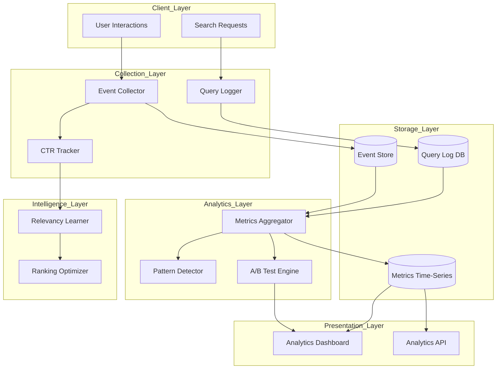

# RFC 006: Search Analytics & Relevancy Intelligence

**Status:** Draft  
**Created:** 2025-11-16  
**Authors:** Meilisearch Community  
**Tracking Issue:** TBD

---

## Summary

This RFC proposes a comprehensive search analytics and relevancy intelligence system that collects query patterns, tracks user interactions, provides real-time analytics dashboards, and enables A/B testing for relevancy tuning. The system will automatically improve search quality over time through click-through rate (CTR) analysis and learned ranking adjustments.

## Motivation

### Current Limitations

Meilisearch currently has basic analytics via [`segment_analytics.rs`](crates/meilisearch/src/analytics/segment_analytics.rs:110) but lacks:

**Missing Capabilities:**

1. **No Query Analytics Dashboard**: Cannot visualize query patterns, popular searches, zero-result queries
2. **No CTR Tracking**: No feedback loop to improve relevancy based on user behavior
3. **No A/B Testing Framework**: Difficult to test ranking rule changes
4. **Limited Relevancy Insights**: Cannot understand why documents ranked as they did
5. **No Automated Optimization**: Manual tuning required for search quality

From [`RESEARCH_PLAN.md`](RESEARCH_PLAN.md:463):

```rust
// Proposed A/B Testing Framework
let experiment = Experiment::new("ranking_test")
    .variant_a(Settings { 
        ranking_rules: vec![Words, Typo, Proximity] 
    })
    .variant_b(Settings { 
        ranking_rules: vec![Words, Proximity, Typo] 
    })
    .traffic_split(50, 50);
```

### Real-World Use Cases

**E-Commerce Search Optimization:**
- Track which products users click after searching
- Identify queries with poor conversion
- A/B test different ranking configurations
- **Need:** Automatic relevancy improvement

**Content Discovery Platform:**
- Analyze search patterns to understand user intent
- Identify trending queries
- Optimize for user engagement
- **Need:** Real-time analytics dashboard

**SaaS Application Search:**
- Per-tenant search quality metrics
- Identify underperforming searches
- Cost attribution per tenant
- **Need:** Multi-tenant analytics

**Documentation Search:**
- Track most searched terms
- Identify missing documentation
- Optimize for common queries
- **Need:** Query pattern analysis

## Technical Design

### Architecture Overview



### 1. Query Logging

**New file:** `crates/meilisearch-analytics/src/query_logger.rs`

```rust
use std::sync::Arc;
use tokio::sync::mpsc;
use serde::{Deserialize, Serialize};

#[derive(Debug, Clone, Serialize, Deserialize)]
pub struct QueryLog {
    /// Unique query ID
    pub query_id: String,
    /// Index queried
    pub index_uid: String,
    /// Query text
    pub query: String,
    /// Filters applied
    pub filters: Option<String>,
    /// Number of results
    pub hits_count: usize,
    /// Processing time
    pub processing_time_ms: u64,
    /// Timestamp
    pub timestamp: i64,
    /// User/session identifier
    pub user_id: Option<String>,
    /// Search type (keyword, semantic, hybrid)
    pub search_type: SearchType,
    /// Semantic ratio (for hybrid)
    pub semantic_ratio: Option<f32>,
    /// Result positions of clicked documents
    pub clicked_positions: Vec<usize>,
    /// Total clicks
    pub total_clicks: usize,
    /// Query latency percentile
    pub latency_bucket: LatencyBucket,
}

#[derive(Debug, Clone, Serialize, Deserialize)]
pub enum SearchType {
    Keyword,
    Semantic,
    Hybrid,
}

#[derive(Debug, Clone, Serialize, Deserialize)]
pub enum LatencyBucket {
    Fast,      // < 10ms
    Normal,    // 10-50ms
    Slow,      // 50-200ms
    VerySlow,  // > 200ms
}

pub struct QueryLogger {
    /// Channel to send query logs
    log_tx: mpsc::UnboundedSender<QueryLog>,
    /// Storage backend
    storage: Arc<QueryStorage>,
}

impl QueryLogger {
    pub fn new(storage: Arc<QueryStorage>) -> (Self, mpsc::UnboundedReceiver<QueryLog>) {
        let (log_tx, log_rx) = mpsc::unbounded_channel();
        
        (Self { log_tx, storage }, log_rx)
    }
    
    /// Log a search query
    pub fn log_query(&self, log: QueryLog) -> Result<()> {
        self.log_tx.send(log)
            .map_err(|_| Error::LogChannelClosed)?;
        Ok(())
    }
    
    /// Background task to persist logs
    pub async fn persist_logs(mut log_rx: mpsc::UnboundedReceiver<QueryLog>, storage: Arc<QueryStorage>) {
        let mut batch = Vec::new();
        let mut last_flush = Instant::now();
        
        loop {
            tokio::select! {
                Some(log) = log_rx.recv() => {
                    batch.push(log);
                    
                    // Flush when batch size reached or 5s elapsed
                    if batch.len() >= 100 || last_flush.elapsed() > Duration::from_secs(5) {
                        if let Err(e) = storage.write_batch(&batch).await {
                            tracing::error!("Failed to write query logs: {}", e);
                        }
                        batch.clear();
                        last_flush = Instant::now();
                    }
                }
                
                _ = tokio::time::sleep(Duration::from_secs(5)) => {
                    if !batch.is_empty() {
                        if let Err(e) = storage.write_batch(&batch).await {
                            tracing::error!("Failed to write query logs: {}", e);
                        }
                        batch.clear();
                        last_flush = Instant::now();
                    }
                }
            }
        }
    }
}

/// Query storage backend
pub struct QueryStorage {
    /// LMDB environment for analytics
    env: Arc<heed::Env>,
    /// Query log database
    query_db: Database<Str, SerdeJson<QueryLog>>,
    /// Time-series metrics database
    metrics_db: Database<U64, SerdeJson<MetricsBucket>>,
}

impl QueryStorage {
    pub async fn write_batch(&self, logs: &[QueryLog]) -> Result<()> {
        let mut wtxn = self.env.write_txn()?;
        
        for log in logs {
            let key = format!("{}:{}", log.timestamp, log.query_id);
            self.query_db.put(&mut wtxn, &key, log)?;
            
            // Update time-series metrics
            self.update_metrics(&mut wtxn, log)?;
        }
        
        wtxn.commit()?;
        Ok(())
    }
    
    fn update_metrics(&self, wtxn: &mut RwTxn, log: &QueryLog) -> Result<()> {
        // Bucket by 5-minute intervals
        let bucket_timestamp = (log.timestamp / 300) * 300;
        
        let mut bucket = self.metrics_db.get(wtxn, &(bucket_timestamp as u64))?
            .unwrap_or_default();
        
        bucket.query_count += 1;
        bucket.total_processing_time_ms += log.processing_time_ms;
        bucket.total_clicks += log.total_clicks;
        bucket.zero_result_count += if log.hits_count == 0 { 1 } else { 0 };
        
        self.metrics_db.put(wtxn, &(bucket_timestamp as u64), &bucket)?;
        
        Ok(())
    }
}

#[derive(Default, Serialize, Deserialize)]
struct MetricsBucket {
    query_count: usize,
    total_processing_time_ms: u64,
    total_clicks: usize,
    zero_result_count: usize,
}
```

### 2. Click-Through Rate (CTR) Tracking

**New file:** `crates/meilisearch-analytics/src/ctr_tracker.rs`

```rust
use std::collections::HashMap;

pub struct CTRTracker {
    /// Tracks clicks per query
    click_data: Arc<RwLock<HashMap<String, ClickData>>>,
    /// Storage for persistence
    storage: Arc<QueryStorage>,
}

#[derive(Default, Clone)]
struct ClickData {
    /// Total impressions (searches)
    impressions: usize,
    /// Clicks per result position
    clicks_by_position: HashMap<usize, usize>,
    /// Total clicks
    total_clicks: usize,
    /// Last updated
    last_updated: Instant,
}

impl CTRTracker {
    pub fn record_impression(&self, query_id: &str, results_count: usize) {
        let mut data = self.click_data.write().unwrap();
        let entry = data.entry(query_id.to_string()).or_default();
        entry.impressions += 1;
        entry.last_updated = Instant::now();
    }
    
    pub fn record_click(&self, query_id: &str, position: usize) {
        let mut data = self.click_data.write().unwrap();
        let entry = data.entry(query_id.to_string()).or_default();
        
        *entry.clicks_by_position.entry(position).or_insert(0) += 1;
        entry.total_clicks += 1;
        entry.last_updated = Instant::now();
    }
    
    /// Compute CTR for a query
    pub fn compute_ctr(&self, query_id: &str) -> Option<f64> {
        let data = self.click_data.read().unwrap();
        let entry = data.get(query_id)?;
        
        if entry.impressions == 0 {
            return None;
        }
        
        Some(entry.total_clicks as f64 / entry.impressions as f64)
    }
    
    /// Compute Mean Reciprocal Rank (MRR)
    pub fn compute_mrr(&self, query_id: &str) -> Option<f64> {
        let data = self.click_data.read().unwrap();
        let entry = data.get(query_id)?;
        
        if entry.clicks_by_position.is_empty() {
            return None;
        }
        
        // MRR = average of 1/rank for first clicks
        let reciprocal_ranks: Vec<f64> = entry.clicks_by_position.iter()
            .map(|(&position, &count)| (count as f64) / ((position + 1) as f64))
            .collect();
        
        let mrr = reciprocal_ranks.iter().sum::<f64>() / reciprocal_ranks.len() as f64;
        Some(mrr)
    }
    
    /// Get top-K most clicked positions for query
    pub fn top_clicked_positions(&self, query_id: &str, k: usize) -> Vec<(usize, usize)> {
        let data = self.click_data.read().unwrap();
        let entry = match data.get(query_id) {
            Some(e) => e,
            None => return Vec::new(),
        };
        
        let mut positions: Vec<_> = entry.clicks_by_position.iter()
            .map(|(&pos, &count)| (pos, count))
            .collect();
        
        positions.sort_by_key(|(_, count)| std::cmp::Reverse(*count));
        positions.truncate(k);
        
        positions
    }
}
```

### 3. A/B Testing Framework

**New file:** `crates/meilisearch-analytics/src/ab_testing.rs`

```rust
use std::collections::HashMap;
use rand::Rng;

pub struct ABTestEngine {
    /// Active experiments
    experiments: Arc<RwLock<HashMap<String, Experiment>>>,
    /// Results tracker
    results: Arc<RwLock<HashMap<String, ExperimentResults>>>,
}

#[derive(Clone, Serialize, Deserialize)]
pub struct Experiment {
    pub experiment_id: String,
    pub index_uid: String,
    pub variants: Vec<Variant>,
    pub traffic_split: Vec<f32>,
    pub start_time: i64,
    pub end_time: Option<i64>,
    pub status: ExperimentStatus,
}

#[derive(Clone, Serialize, Deserialize)]
pub struct Variant {
    pub variant_id: String,
    pub settings: Settings,
    pub description: String,
}

#[derive(Clone, Serialize, Deserialize)]
pub enum ExperimentStatus {
    Draft,
    Running,
    Completed,
    Stopped,
}

#[derive(Default)]
pub struct ExperimentResults {
    pub variant_metrics: HashMap<String, VariantMetrics>,
}

#[derive(Default, Serialize, Deserialize)]
pub struct VariantMetrics {
    pub impressions: usize,
    pub clicks: usize,
    pub ctr: f64,
    pub mrr: f64,
    pub avg_processing_time_ms: f64,
    pub zero_results_rate: f64,
}

impl ABTestEngine {
    pub fn new() -> Self {
        Self {
            experiments: Arc::new(RwLock::new(HashMap::new())),
            results: Arc::new(RwLock::new(HashMap::new())),
        }
    }
    
    /// Create a new experiment
    pub fn create_experiment(&self, experiment: Experiment) -> Result<()> {
        let mut experiments = self.experiments.write().unwrap();
        experiments.insert(experiment.experiment_id.clone(), experiment);
        Ok(())
    }
    
    /// Assign user to experiment variant
    pub fn assign_variant(&self, experiment_id: &str, user_id: &str) -> Option<String> {
        let experiments = self.experiments.read().unwrap();
        let experiment = experiments.get(experiment_id)?;
        
        if !matches!(experiment.status, ExperimentStatus::Running) {
            return None;
        }
        
        // Consistent hash-based assignment
        let mut hasher = std::collections::hash_map::DefaultHasher::new();
        use std::hash::{Hash, Hasher};
        user_id.hash(&mut hasher);
        experiment_id.hash(&mut hasher);
        let hash = hasher.finish();
        
        let normalized = (hash % 10000) as f32 / 10000.0;
        
        // Determine variant based on traffic split
        let mut cumulative = 0.0;
        for (i, &split) in experiment.traffic_split.iter().enumerate() {
            cumulative += split;
            if normalized < cumulative {
                return Some(experiment.variants[i].variant_id.clone());
            }
        }
        
        Some(experiment.variants.last()?.variant_id.clone())
    }
    
    /// Record query result for experiment
    pub fn record_query(
        &self,
        experiment_id: &str,
        variant_id: &str,
        query_log: &QueryLog,
    ) {
        let mut results = self.results.write().unwrap();
        let exp_results = results.entry(experiment_id.to_string()).or_default();
        let metrics = exp_results.variant_metrics.entry(variant_id.to_string()).or_default();
        
        metrics.impressions += 1;
        metrics.clicks += query_log.total_clicks;
        
        // Update running averages
        let n = metrics.impressions as f64;
        metrics.ctr = metrics.clicks as f64 / n;
        metrics.avg_processing_time_ms = 
            (metrics.avg_processing_time_ms * (n - 1.0) + query_log.processing_time_ms as f64) / n;
        
        if query_log.hits_count == 0 {
            metrics.zero_results_rate = 
                (metrics.zero_results_rate * (n - 1.0) + 1.0) / n;
        } else {
            metrics.zero_results_rate = 
                (metrics.zero_results_rate * (n - 1.0)) / n;
        }
    }
    
    /// Get experiment results
    pub fn get_results(&self, experiment_id: &str) -> Option<ExperimentResults> {
        let results = self.results.read().unwrap();
        results.get(experiment_id).cloned()
    }
    
    /// Determine winning variant (statistical significance)
    pub fn determine_winner(&self, experiment_id: &str, confidence: f64) -> Option<String> {
        let results = self.results.read().unwrap();
        let exp_results = results.get(experiment_id)?;
        
        if exp_results.variant_metrics.len() < 2 {
            return None;
        }
        
        // Find variant with highest CTR
        let mut best_variant: Option<(&String, &VariantMetrics)> = None;
        
        for (variant_id, metrics) in &exp_results.variant_metrics {
            if let Some((_, best_metrics)) = best_variant {
                if metrics.ctr > best_metrics.ctr {
                    best_variant = Some((variant_id, metrics));
                }
            } else {
                best_variant = Some((variant_id, metrics));
            }
        }
        
        let (winner_id, winner_metrics) = best_variant?;
        
        // Check statistical significance using z-test
        for (variant_id, metrics) in &exp_results.variant_metrics {
            if variant_id == winner_id {
                continue;
            }
            
            let z_score = calculate_z_score(
                winner_metrics.ctr,
                winner_metrics.impressions,
                metrics.ctr,
                metrics.impressions,
            );
            
            // z-score > 1.96 = 95% confidence
            // z-score > 2.576 = 99% confidence
            let required_z = if confidence >= 0.99 { 2.576 } else { 1.96 };
            
            if z_score < required_z {
                // Not statistically significant
                return None;
            }
        }
        
        Some(winner_id.clone())
    }
}

fn calculate_z_score(
    ctr_a: f64,
    n_a: usize,
    ctr_b: f64,
    n_b: usize,
) -> f64 {
    let p_pooled = ((ctr_a * n_a as f64) + (ctr_b * n_b as f64)) / (n_a + n_b) as f64;
    let se = (p_pooled * (1.0 - p_pooled) * (1.0 / n_a as f64 + 1.0 / n_b as f64)).sqrt();
    
    if se == 0.0 {
        return 0.0;
    }
    
    ((ctr_a - ctr_b) / se).abs()
}
```

### 4. Analytics Dashboard Data API

**New file:** `crates/meilisearch/src/routes/analytics.rs`

```rust
use actix_web::{web, HttpResponse};

/// Get analytics overview
pub async fn get_analytics_overview(
    index_scheduler: Data<IndexScheduler>,
    index_uid: web::Path<String>,
    params: web::Query<AnalyticsParams>,
) -> Result<HttpResponse, ResponseError> {
    let analytics = index_scheduler.analytics();
    
    let start_time = params.start_time.unwrap_or_else(|| {
        OffsetDateTime::now_utc() - Duration::days(7)
    });
    let end_time = params.end_time.unwrap_or_else(OffsetDateTime::now_utc);
    
    let overview = analytics.get_overview(&index_uid, start_time, end_time)?;
    
    Ok(HttpResponse::Ok().json(overview))
}

#[derive(Serialize)]
pub struct AnalyticsOverview {
    pub total_queries: usize,
    pub unique_queries: usize,
    pub avg_processing_time_ms: f64,
    pub p50_processing_time_ms: f64,
    pub p95_processing_time_ms: f64,
    pub p99_processing_time_ms: f64,
    pub total_clicks: usize,
    pub overall_ctr: f64,
    pub zero_results_rate: f64,
    pub top_queries: Vec<PopularQuery>,
    pub search_type_distribution: HashMap<SearchType, usize>,
    pub latency_distribution: HashMap<LatencyBucket, usize>,
}

#[derive(Serialize)]
pub struct PopularQuery {
    pub query: String,
    pub count: usize,
    pub avg_hits: f64,
    pub ctr: f64,
}

/// Get detailed query analysis
pub async fn get_query_analysis(
    index_scheduler: Data<IndexScheduler>,
    index_uid: web::Path<String>,
    query: web::Query<String>,
) -> Result<HttpResponse, ResponseError> {
    let analytics = index_scheduler.analytics();
    
    let analysis = analytics.analyze_query(&index_uid, &query)?;
    
    Ok(HttpResponse::Ok().json(analysis))
}

#[derive(Serialize)]
pub struct QueryAnalysis {
    pub query: String,
    pub total_searches: usize,
    pub unique_users: usize,
    pub avg_results: f64,
    pub avg_processing_time_ms: f64,
    pub ctr: f64,
    pub mrr: f64,
    pub top_clicked_documents: Vec<ClickedDocument>,
    pub zero_results_count: usize,
    pub recent_searches: Vec<RecentSearch>,
}

#[derive(Serialize)]
pub struct ClickedDocument {
    pub document_id: String,
    pub title: String,
    pub clicks: usize,
    pub avg_position: f64,
}

#[derive(Serialize)]
pub struct RecentSearch {
    pub timestamp: i64,
    pub results_count: usize,
    pub processing_time_ms: u64,
    pub clicked: bool,
}
```

### 5. Relevancy Learning

**New file:** `crates/meilisearch-analytics/src/relevancy_learner.rs`

```rust
pub struct RelevancyLearner {
    ctr_tracker: Arc<CTRTracker>,
    index_scheduler: Arc<IndexScheduler>,
}

impl RelevancyLearner {
    /// Analyze query patterns and suggest improvements
    pub async fn suggest_improvements(
        &self,
        index_uid: &str,
    ) -> Result<Vec<RelevancySuggestion>> {
        let mut suggestions = Vec::new();
        
        // 1. Identify high-zero-result queries
        let zero_result_queries = self.find_zero_result_queries(index_uid).await?;
        if !zero_result_queries.is_empty() {
            suggestions.push(RelevancySuggestion {
                suggestion_type: SuggestionType::AddSynonyms,
                description: format!(
                    "{} queries frequently return zero results. Consider adding synonyms.",
                    zero_result_queries.len()
                ),
                affected_queries: zero_result_queries,
                expected_impact: Impact::High,
            });
        }
        
        // 2. Identify low-CTR queries
        let low_ctr_queries = self.find_low_ctr_queries(index_uid, 0.05).await?;
        if !low_ctr_queries.is_empty() {
            suggestions.push(RelevancySuggestion {
                suggestion_type: SuggestionType::AdjustRanking,
                description: format!(
                    "{} queries have low click-through rates (< 5%). Ranking may need adjustment.",
                    low_ctr_queries.len()
                ),
                affected_queries: low_ctr_queries,
                expected_impact: Impact::Medium,
            });
        }
        
        // 3. Detect hybrid search opportunities
        let keyword_only_queries = self.find_semantic_opportunities(index_uid).await?;
        if !keyword_only_queries.is_empty() {
            suggestions.push(RelevancySuggestion {
                suggestion_type: SuggestionType::EnableHybridSearch,
                description: format!(
                    "{} queries might benefit from semantic search. Consider enabling hybrid search.",
                    keyword_only_queries.len()
                ),
                affected_queries: keyword_only_queries,
                expected_impact: Impact::High,
            });
        }
        
        Ok(suggestions)
    }
    
    async fn find_zero_result_queries(&self, index_uid: &str) -> Result<Vec<String>> {
        // Query analytics storage for zero-result queries
        // Returns list of queries that frequently return 0 results
        todo!()
    }
    
    async fn find_low_ctr_queries(&self, index_uid: &str, threshold: f64) -> Result<Vec<String>> {
        // Find queries with CTR below threshold
        todo!()
    }
}

#[derive(Serialize)]
pub struct RelevancySuggestion {
    pub suggestion_type: SuggestionType,
    pub description: String,
    pub affected_queries: Vec<String>,
    pub expected_impact: Impact,
}

#[derive(Serialize)]
pub enum SuggestionType {
    AddSynonyms,
    AdjustRanking,
    EnableHybridSearch,
    ReduceTypoTolerance,
    IncreaseTypoTolerance,
    AddStopWords,
}

#[derive(Serialize)]
pub enum Impact {
    Low,
    Medium,
    High,
}
```

## API Changes

### New Analytics Endpoints

```http
# Get analytics overview
GET /indexes/{indexUid}/analytics/overview
Query params: ?from=2025-01-01&to=2025-01-31

Response:
{
  "totalQueries": 150000,
  "uniqueQueries": 5000,
  "avgProcessingTimeMs": 15.5,
  "p95ProcessingTimeMs": 45.2,
  "overallCTR": 0.23,
  "zeroResultsRate": 0.05,
  "topQueries": [
    {"query": "laptop", "count": 5000, "ctr": 0.35},
    {"query": "headphones", "count": 3200, "ctr": 0.28}
  ]
}

# Get query-specific analysis
GET /indexes/{indexUid}/analytics/queries/{query}

Response:
{
  "query": "laptop",
  "totalSearches": 5000,
  "ctr": 0.35,
  "mrr": 0.82,
  "topClickedDocuments": [
    {"documentId": "doc123", "clicks": 450, "avgPosition": 1.2}
  ]
}

# Create A/B test
POST /indexes/{indexUid}/experiments

{
  "experimentId": "ranking_test_1",
  "variants": [
    {
      "variantId": "control",
      "settings": {
        "rankingRules": ["words", "typo", "proximity", "attribute", "sort", "exactness"]
      }
    },
    {
      "variantId": "treatment",
      "settings": {
        "rankingRules": ["words", "proximity", "typo", "attribute", "sort", "exactness"]
      }
    }
  ],
  "trafficSplit": [0.5, 0.5]
}

# Get experiment results
GET /indexes/{indexUid}/experiments/{experimentId}/results

Response:
{
  "experimentId": "ranking_test_1",
  "status": "running",
  "variants": {
    "control": {
      "impressions": 50000,
      "clicks": 11500,
      "ctr": 0.23,
      "mrr": 0.78,
      "avgProcessingTimeMs": 15.2
    },
    "treatment": {
      "impressions": 50000,
      "clicks": 13000,
      "ctr": 0.26,
      "mrr": 0.82,
      "avgProcessingTimeMs": 14.8
    }
  },
  "winner": "treatment",
  "confidence": 0.99
}

# Get relevancy suggestions
GET /indexes/{indexUid}/analytics/suggestions

Response:
{
  "suggestions": [
    {
      "type": "addSynonyms",
      "description": "12 queries have zero results. Consider adding synonyms.",
      "affectedQueries": ["laptop", "notebook", "computer"],
      "expectedImpact": "high"
    }
  ]
}
```

### Click Tracking API

```http
# Track user click
POST /indexes/{indexUid}/analytics/clicks

{
  "queryId": "query_12345",
  "documentId": "doc_789",
  "position": 2,
  "timestamp": 1699564800
}
```

## Backward Compatibility

### Compatibility Strategy

1. **Analytics disabled by default**: Opt-in via `--experimental-search-analytics`
2. **No impact on existing functionality**: Analytics runs independently
3. **Privacy-conscious**: Configurable data retention, GDPR-compliant
4. **Zero performance overhead when disabled**: No instrumentation unless enabled

## Implementation Plan

### Phase 1: Query Logging (3 weeks)

**Tasks:**
1. Implement QueryLogger with LMDB storage
2. Add query logging middleware
3. Create time-series aggregation
4. Unit tests

**Deliverables:**
- Query logs persisted to disk
- Basic metrics computed
- API for retrieving logs

### Phase 2: CTR Tracking (2 weeks)

**Tasks:**
1. Implement CTRTracker
2. Add click tracking API endpoint
3. Compute MRR, CTR metrics
4. Integration tests

**Deliverables:**
- Click tracking working
- Metrics computed correctly

### Phase 3: A/B Testing (4 weeks)

**Tasks:**
1. Implement ABTestEngine
2. Add experiment management API
3. Variant assignment logic
4. Statistical significance testing

**Deliverables:**
- A/B testing framework complete
- Experiment management UI-ready
- Statistical analysis working

### Phase 4: Analytics Dashboard (3 weeks)

**Tasks:**
1. Design dashboard UI
2. Implement analytics API endpoints
3. Create visualizations
4. Real-time updates

**Deliverables:**
- Dashboard accessible at /_analytics
- Real-time metrics
- Export functionality

### Phase 5: Relevancy Learning (3 weeks)

**Tasks:**
1. Implement RelevancyLearner
2. Pattern detection algorithms
3. Automatic suggestion generation
4. Integration with ranking

**Deliverables:**
- Relevancy suggestions working
- Automated learning (optional)

## Performance Implications

### Storage Overhead

**Query logs (1M queries/day):**
```
Avg query log size: 500 bytes
Daily storage: 500MB
Weekly: 3.5GB
Monthly (30 days retention): 15GB
```

**Metrics aggregation:**
```
5-minute buckets per day: 288
Storage per bucket: 1KB
Daily: ~300KB
Monthly: ~9MB
```

**Total monthly storage:** ~15GB (configurable retention)

### Query Latency Overhead

**With analytics enabled:**
```
Query logging: +0.5ms
CTR lookup: +0.2ms
A/B test assignment: +0.1ms
Total overhead: +0.8ms (5% for 15ms queries)
```

**Mitigation:** Async logging, no blocking

## Drawbacks

### 1. Storage Requirements

15GB/month for 1M queries can add up

**Mitigation:** Configurable retention, sampling for high-volume deployments

### 2. Privacy Concerns

Query logs may contain sensitive information

**Mitigation:** 
- Hash user IDs
- Configurable PII filtering
- GDPR-compliant retention policies
- Opt-out mechanisms

### 3. Operational Complexity

Additional database to manage

**Mitigation:** Same LMDB infrastructure, familiar tools

## Alternatives Considered

### 1. External Analytics Services

**Approach:** Integrate with Mixpanel, Amplitude, etc.

**Why not chosen:**
- Requires external dependency
- Data leaves Meilisearch
- Privacy concerns
- Better to build native

### 2. Log-Based Analytics

**Approach:** Parse access logs for analytics

**Why not chosen:**
- Limited data (no clicks, user behavior)
- Difficult to correlate queries and clicks
- No real-time capabilities

### 3. Plugin Architecture

**Approach:** Allow users to add analytics plugins

**Why not chosen:**
- Complex to design and maintain
- Native integration more performant
- Can add plugin system later if needed

## Open Questions

### 1. Data Retention Defaults

**Question:** Default retention period for query logs?

**Options:**
- A: 7 days (minimal)
- B: 30 days (balanced)
- C: 90 days (comprehensive)

**Recommendation:** Option B with configurable override

### 2. Real-Time vs. Batch Processing

**Question:** Should analytics update in real-time or batch?

**Options:**
- A: Real-time (complex, higher overhead)
- B: 5-minute batches (balanced)
- C: Hourly batches (simple, delayed insights)

**Recommendation:** Option B

### 3. Privacy Mode

**Question:** Should analytics support privacy mode?

**Options:**
- A: Yes, with query hashing and no user tracking
- B: No, users can disable entirely
- C: Configurable levels (anonymous, aggregated, detailed)

**Recommendation:** Option C

## References

### Research on Search Analytics

1. **Query Log Analysis:**
   - Silverstein, C., et al. (1999). "Analysis of a Very Large Web Search Engine Query Log." *SIGIR Forum*.

2. **A/B Testing:**
   - Kohavi, R., et al. (2009). "Controlled Experiments on the Web." *KDD*.

3. **Click Models:**
   - Chuklin, A., et al. (2015). "Click Models for Web Search." *Morgan & Claypool*.

### Existing Analytics Systems

1. **Elasticsearch:**
   - Kibana for analytics
   - [Documentation](https://www.elastic.co/kibana)

2. **Algolia:**
   - Built-in analytics dashboard
   - [Analytics API](https://www.algolia.com/doc/rest-api/analytics/)

### Meilisearch Codebase

1. **Current analytics:** [`crates/meilisearch/src/analytics/segment_analytics.rs`](crates/meilisearch/src/analytics/segment_analytics.rs:110)
2. **Search routes:** [`crates/meilisearch/src/routes/indexes/search.rs`](crates/meilisearch/src/routes/indexes/search.rs:1)

## Community Discussion

Key discussion points:

1. **Privacy compliance:** How to ensure GDPR/CCPA compliance?
2. **Storage costs:** Is 15GB/month acceptable for most users?
3. **Dashboard design:** What metrics are most valuable?
4. **Automated learning:** Should relevancy improve automatically or require approval?

**Discussion link:** TBD after posting to GitHub

---

**Changelog:**
- 2025-11-16: Initial draft created