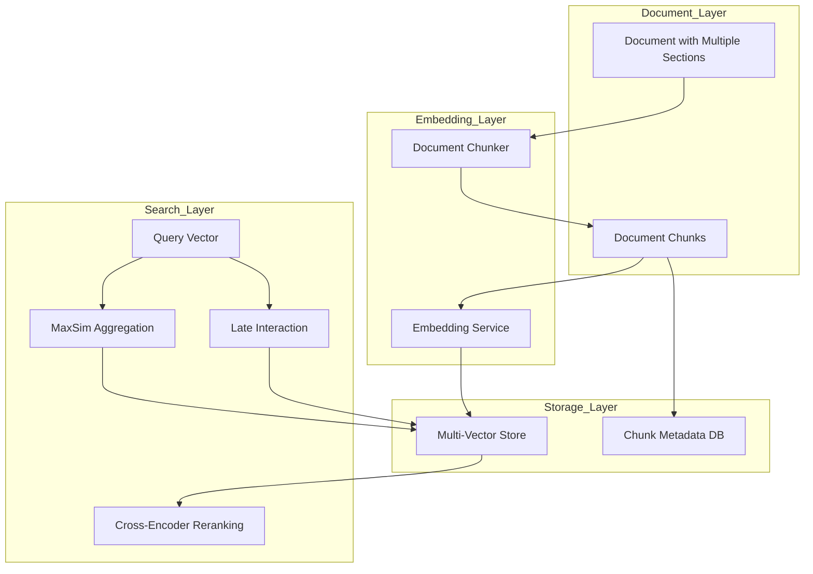

# RFC 009: Multi-Vector Documents & Advanced RAG Support

**Status:** Draft  
**Created:** 2025-11-16  
**Authors:** Meilisearch Community  
**Tracking Issue:** TBD

---

## Summary

This RFC proposes extending Meilisearch's vector search capabilities to support multiple embeddings per document, enabling advanced Retrieval-Augmented Generation (RAG) patterns, chunk-based document representation, late interaction models (ColBERT-style), and cross-encoder reranking. These enhancements will position Meilisearch as a comprehensive solution for modern semantic search applications.

## Motivation

### Current Limitations

From [`RESEARCH_PLAN.md`](RESEARCH_PLAN.md:383), multi-vector documents are identified as a key limitation:

**Current Constraint:**
```rust
// Current: One vector per embedder per document
{
  "id": 1,
  "_vectors": {
    "default": [0.1, 0.2, ..., 0.8]  // Single embedding for entire document
  }
}

// Limitation: Long documents compressed into single vector
// Result: Loss of semantic nuance, poor retrieval for specific sections
```

**Proposed:**
```rust
{
  "id": 1,
  "_vectors": {
    "default": [
      [0.1, 0.2, ...],  // Chunk 1: Introduction
      [0.3, 0.4, ...],  // Chunk 2: Method
      [0.5, 0.6, ...]   // Chunk 3: Results
    ]
  }
}
```

### Real-World Use Cases

**Long-Form Content Retrieval:**
- Research papers (10-50 pages)
- Legal documents (100+ pages)
- Technical manuals
- **Problem:** Single embedding loses section-specific semantics
- **Solution:** Multiple embeddings per document section

**Multi-Modal Documents:**
- Product pages (title, description, reviews, specifications)
- News articles (headline, body, summary)
- **Problem:** Different aspects need different embeddings
- **Solution:** Aspect-specific vectors

**RAG Pipelines:**
- Current: Chunk documents externally, lose document context
- Proposed: Store chunks as multi-vector documents, preserve document structure
- **Benefit:** Better citation, improved context window utilization

**Cross-Language Search:**
- Document in multiple languages
- **Problem:** Single embedding averages languages
- **Solution:** Separate embedding per language version

## Technical Design

### Architecture Overview



### 1. Multi-Vector Document Structure

**Modified:** `crates/milli/src/vector/mod.rs`

```rust
use std::collections::HashMap;

/// Multi-vector document representation
#[derive(Debug, Clone, Serialize, Deserialize)]
pub struct MultiVectorDocument {
    pub document_id: DocumentId,
    /// Embeddings grouped by embedder name
    pub embeddings: HashMap<String, Vec<Embedding>>,
    /// Metadata for each embedding (chunk info)
    pub metadata: HashMap<String, Vec<ChunkMetadata>>,
}

#[derive(Debug, Clone, Serialize, Deserialize)]
pub struct Embedding {
    /// The actual vector
    pub vector: Vec<f32>,
    /// Optional chunk identifier
    pub chunk_id: Option<String>,
}

#[derive(Debug, Clone, Serialize, Deserialize)]
pub struct ChunkMetadata {
    /// Chunk index within document
    pub index: usize,
    /// Character offset start
    pub char_start: usize,
    /// Character offset end
    pub char_end: usize,
    /// Optional chunk type (title, body, summary, etc.)
    pub chunk_type: Option<String>,
    /// Chunk text (for citation)
    pub text: String,
}
```

### 2. Document Chunking Strategy

**New file:** `crates/milli/src/vector/chunking.rs`

```rust
pub struct DocumentChunker {
    strategy: ChunkingStrategy,
}

pub enum ChunkingStrategy {
    /// Fixed token count per chunk
    FixedSize { tokens: usize, overlap: usize },
    /// Semantic boundaries (sentences, paragraphs)
    Semantic { max_tokens: usize },
    /// Field-based (one chunk per field)
    FieldBased { fields: Vec<String> },
    /// Custom user-provided chunks
    Manual,
}

impl DocumentChunker {
    pub fn chunk_document(
        &self,
        document: &serde_json::Value,
        embedder_config: &EmbedderConfig,
    ) -> Result<Vec<Chunk>> {
        match &self.strategy {
            ChunkingStrategy::FixedSize { tokens, overlap } => {
                self.chunk_fixed_size(document, *tokens, *overlap, embedder_config)
            }
            ChunkingStrategy::Semantic { max_tokens } => {
                self.chunk_semantic(document, *max_tokens, embedder_config)
            }
            ChunkingStrategy::FieldBased { fields } => {
                self.chunk_by_fields(document, fields, embedder_config)
            }
            ChunkingStrategy::Manual => {
                self.extract_manual_chunks(document)
            }
        }
    }
    
    fn chunk_fixed_size(
        &self,
        document: &serde_json::Value,
        chunk_size: usize,
        overlap: usize,
        config: &EmbedderConfig,
    ) -> Result<Vec<Chunk>> {
        // Apply document template
        let text = apply_template(document, &config.document_template)?;
        
        // Tokenize
        let tokens = tokenize(&text);
        
        let mut chunks = Vec::new();
        let mut start = 0;
        
        while start < tokens.len() {
            let end = (start + chunk_size).min(tokens.len());
            let chunk_tokens = &tokens[start..end];
            let chunk_text = detokenize(chunk_tokens);
            
            chunks.push(Chunk {
                index: chunks.len(),
                text: chunk_text,
                char_start: tokens[start].char_start,
                char_end: tokens[end - 1].char_end,
                chunk_type: None,
            });
            
            // Overlap for context
            start += chunk_size - overlap;
        }
        
        Ok(chunks)
    }
    
    fn chunk_semantic(
        &self,
        document: &serde_json::Value,
        max_tokens: usize,
        config: &EmbedderConfig,
    ) -> Result<Vec<Chunk>> {
        let text = apply_template(document, &config.document_template)?;
        
        // Split on sentence boundaries
        let sentences = split_sentences(&text);
        
        let mut chunks = Vec::new();
        let mut current_chunk = Vec::new();
        let mut current_tokens = 0;
        
        for sentence in sentences {
            let sentence_tokens = count_tokens(&sentence);
            
            if current_tokens + sentence_tokens > max_tokens && !current_chunk.is_empty() {
                // Flush current chunk
                chunks.push(Chunk {
                    index: chunks.len(),
                    text: current_chunk.join(" "),
                    char_start: 0, // TODO: track actual positions
                    char_end: 0,
                    chunk_type: Some("paragraph".to_string()),
                });
                
                current_chunk.clear();
                current_tokens = 0;
            }
            
            current_chunk.push(sentence);
            current_tokens += sentence_tokens;
        }
        
        // Final chunk
        if !current_chunk.is_empty() {
            chunks.push(Chunk {
                index: chunks.len(),
                text: current_chunk.join(" "),
                char_start: 0,
                char_end: 0,
                chunk_type: Some("paragraph".to_string()),
            });
        }
        
        Ok(chunks)
    }
    
    fn chunk_by_fields(
        &self,
        document: &serde_json::Value,
        fields: &[String],
        _config: &EmbedderConfig,
    ) -> Result<Vec<Chunk>> {
        let mut chunks = Vec::new();
        
        for field in fields {
            if let Some(value) = document.get(field) {
                if let Some(text) = value.as_str() {
                    chunks.push(Chunk {
                        index: chunks.len(),
                        text: text.to_string(),
                        char_start: 0,
                        char_end: text.len(),
                        chunk_type: Some(field.clone()),
                    });
                }
            }
        }
        
        Ok(chunks)
    }
}

pub struct Chunk {
    pub index: usize,
    pub text: String,
    pub char_start: usize,
    pub char_end: usize,
    pub chunk_type: Option<String>,
}
```

### 3. MaxSim Scoring for Multi-Vector Search

**New file:** `crates/milli/src/search/multi_vector_scoring.rs`

```rust
/// Maximum Similarity (MaxSim) scoring for multi-vector documents
pub fn maxsim_score(
    query_vector: &[f32],
    document_vectors: &[Vec<f32>],
    distance_metric: DistanceMetric,
) -> f32 {
    // For each document vector, compute similarity to query
    // Return maximum similarity
    
    document_vectors.iter()
        .map(|doc_vec| {
            match distance_metric {
                DistanceMetric::Cosine => cosine_similarity(query_vector, doc_vec),
                DistanceMetric::Euclidean => euclidean_distance(query_vector, doc_vec),
                DistanceMetric::DotProduct => dot_product(query_vector, doc_vec),
            }
        })
        .max_by(|a, b| a.partial_cmp(b).unwrap())
        .unwrap_or(0.0)
}

/// Average similarity across all chunks
pub fn avgsim_score(
    query_vector: &[f32],
    document_vectors: &[Vec<f32>],
    distance_metric: DistanceMetric,
) -> f32 {
    if document_vectors.is_empty() {
        return 0.0;
    }
    
    let total: f32 = document_vectors.iter()
        .map(|doc_vec| {
            match distance_metric {
                DistanceMetric::Cosine => cosine_similarity(query_vector, doc_vec),
                DistanceMetric::Euclidean => euclidean_distance(query_vector, doc_vec),
                DistanceMetric::DotProduct => dot_product(query_vector, doc_vec),
            }
        })
        .sum();
    
    total / document_vectors.len() as f32
}

/// Late interaction (ColBERT-style) scoring
pub fn late_interaction_score(
    query_vectors: &[Vec<f32>],  // Multiple query token embeddings
    document_vectors: &[Vec<f32>], // Multiple document token embeddings
) -> f32 {
    let mut total_score = 0.0;
    
    // For each query token, find maximum similarity with any document token
    for query_vec in query_vectors {
        let max_sim = document_vectors.iter()
            .map(|doc_vec| cosine_similarity(query_vec, doc_vec))
            .max_by(|a, b| a.partial_cmp(b).unwrap())
            .unwrap_or(0.0);
        
        total_score += max_sim;
    }
    
    // Average across query tokens
    total_score / query_vectors.len() as f32
}
```

### 4. Cross-Encoder Reranking

**New file:** `crates/milli/src/search/reranking.rs`

```rust
use candle_core::{Device, Tensor};

/// Cross-encoder for precise relevance scoring
pub struct CrossEncoderReranker {
    model: Arc<Mutex<CrossEncoderModel>>,
    device: Device,
    batch_size: usize,
}

impl CrossEncoderReranker {
    pub fn new(model_path: &Path, device: Device) -> Result<Self> {
        let model = load_cross_encoder_model(model_path, &device)?;
        
        Ok(Self {
            model: Arc::new(Mutex::new(model)),
            device,
            batch_size: 32,
        })
    }
    
    /// Rerank search results using cross-encoder
    pub fn rerank(
        &self,
        query: &str,
        results: Vec<(DocumentId, f32, String)>, // (id, score, text)
        top_k: usize,
    ) -> Result<Vec<(DocumentId, f32)>> {
        // 1. Take top N*3 results from first-stage retrieval
        let candidates: Vec<_> = results.into_iter()
            .take(top_k * 3)
            .collect();
        
        // 2. Score each with cross-encoder
        let mut reranked_scores = Vec::new();
        
        for batch in candidates.chunks(self.batch_size) {
            let scores = self.score_batch(query, batch)?;
            reranked_scores.extend(scores);
        }
        
        // 3. Sort by cross-encoder score and return top-k
        let mut final_results: Vec<_> = candidates.into_iter()
            .zip(reranked_scores.into_iter())
            .map(|((doc_id, _, _), new_score)| (doc_id, new_score))
            .collect();
        
        final_results.sort_by(|a, b| b.1.partial_cmp(&a.1).unwrap());
        final_results.truncate(top_k);
        
        Ok(final_results)
    }
    
    fn score_batch(
        &self,
        query: &str,
        batch: &[(DocumentId, f32, String)],
    ) -> Result<Vec<f32>> {
        let model = self.model.lock().unwrap();
        
        // Prepare input pairs
        let pairs: Vec<(String, String)> = batch.iter()
            .map(|(_, _, text)| (query.to_string(), text.clone()))
            .collect();
        
        // Tokenize
        let tokenized = model.tokenizer.encode_batch_pairs(pairs)?;
        
        // Run inference
        let input_ids = Tensor::from_slice(
            &tokenized.get_ids(),
            (batch.len(), tokenized[0].get_ids().len()),
            &self.device,
        )?;
        
        let scores = model.forward(&input_ids)?;
        
        // Extract scores
        let scores_vec = scores.to_vec1::<f32>()?;
        
        Ok(scores_vec)
    }
}
```

### 5. Multi-Vector Storage Extension

**Modified:** `crates/milli/src/vector/store.rs`

```rust
impl VectorStore {
    /// Add multiple vectors for a single document
    pub fn add_multi_vector_document(
        &self,
        wtxn: &mut RwTxn,
        doc_id: DocumentId,
        embedder_name: &str,
        vectors: Vec<Vec<f32>>,
        metadata: Vec<ChunkMetadata>,
    ) -> Result<()> {
        let embedder_id = self.get_or_create_embedder_id(embedder_name)?;
        
        // Validate
        if vectors.len() != metadata.len() {
            return Err(Error::VectorMetadataMismatch);
        }
        
        // Store each vector with chunk index
        for (chunk_idx, (vector, chunk_meta)) in vectors.iter().zip(metadata.iter()).enumerate() {
            let chunk_key = ChunkKey {
                doc_id,
                embedder_id,
                chunk_idx: chunk_idx as u32,
            };
            
            // Store vector
            self.vector_db.put(wtxn, &chunk_key, vector)?;
            
            // Store metadata
            self.metadata_db.put(wtxn, &chunk_key, chunk_meta)?;
        }
        
        // Update document chunk count
        self.doc_chunk_count.put(
            wtxn,
            &(doc_id, embedder_id),
            &(vectors.len() as u32),
        )?;
        
        Ok(())
    }
    
    /// Search using MaxSim aggregation
    pub fn search_multi_vector_maxsim(
        &self,
        rtxn: &RoTxn,
        embedder_name: &str,
        query_vector: &[f32],
        limit: usize,
        filter: Option<&RoaringBitmap>,
    ) -> Result<Vec<(DocumentId, f32, Vec<usize>)>> {
        let embedder_id = self.get_embedder_id(embedder_name)?;
        
        // 1. Retrieve all document chunks
        let mut doc_scores: HashMap<DocumentId, (f32, Vec<usize>)> = HashMap::new();
        
        for chunk in self.iter_chunks(rtxn, embedder_id)? {
            let (chunk_key, chunk_vector) = chunk?;
            
            // Skip if document filtered out
            if let Some(filter) = filter {
                if !filter.contains(chunk_key.doc_id) {
                    continue;
                }
            }
            
            // Compute similarity
            let similarity = cosine_similarity(query_vector, &chunk_vector);
            
            // Update max score for this document
            let entry = doc_scores.entry(chunk_key.doc_id)
                .or_insert((0.0, Vec::new()));
            
            if similarity > entry.0 {
                entry.0 = similarity;
                entry.1 = vec![chunk_key.chunk_idx as usize];
            } else if (similarity - entry.0).abs() < 0.001 {
                // Multiple chunks with same score
                entry.1.push(chunk_key.chunk_idx as usize);
            }
        }
        
        // 2. Sort by score and return top-k
        let mut results: Vec<_> = doc_scores.into_iter()
            .map(|(doc_id, (score, chunks))| (doc_id, score, chunks))
            .collect();
        
        results.sort_by(|a, b| b.1.partial_cmp(&a.1).unwrap());
        results.truncate(limit);
        
        Ok(results)
    }
}

#[derive(Debug, Clone, Copy)]
struct ChunkKey {
    doc_id: DocumentId,
    embedder_id: u8,
    chunk_idx: u32,
}
```

### 6. Contextual Chunk Retrieval

**New file:** `crates/milli/src/search/contextual_retrieval.rs`

```rust
/// Retrieve document chunks with surrounding context
pub struct ContextualRetriever {
    context_window: usize,
}

impl ContextualRetriever {
    pub fn retrieve_with_context(
        &self,
        rtxn: &RoTxn,
        index: &Index,
        doc_id: DocumentId,
        chunk_indices: &[usize],
    ) -> Result<Vec<ChunkWithContext>> {
        let mut results = Vec::new();
        
        for &chunk_idx in chunk_indices {
            // Get target chunk
            let chunk = self.get_chunk(rtxn, index, doc_id, chunk_idx)?;
            
            // Get surrounding chunks for context
            let before = if chunk_idx > 0 {
                self.get_chunks_range(
                    rtxn,
                    index,
                    doc_id,
                    chunk_idx.saturating_sub(self.context_window)..chunk_idx,
                )?
            } else {
                Vec::new()
            };
            
            let after = self.get_chunks_range(
                rtxn,
                index,
                doc_id,
                (chunk_idx + 1)..(chunk_idx + 1 + self.context_window),
            )?;
            
            results.push(ChunkWithContext {
                chunk,
                before_context: before,
                after_context: after,
            });
        }
        
        Ok(results)
    }
}

#[derive(Debug, Serialize)]
pub struct ChunkWithContext {
    pub chunk: ChunkMetadata,
    pub before_context: Vec<ChunkMetadata>,
    pub after_context: Vec<ChunkMetadata>,
}
```

## API Changes

### Document Format with Multi-Vector

**New document structure:**

```json
{
  "id": "article_123",
  "title": "Introduction to Machine Learning",
  "content": "Machine learning is a subset of AI...",
  "_vectors": {
    "default": {
      "chunks": [
        {
          "vector": [0.1, 0.2, ..., 0.8],
          "metadata": {
            "type": "title",
            "text": "Introduction to Machine Learning",
            "charStart": 0,
            "charEnd": 35
          }
        },
        {
          "vector": [0.3, 0.4, ..., 0.9],
          "metadata": {
            "type": "paragraph",
            "text": "Machine learning is a subset...",
            "charStart": 36,
            "charEnd": 200
          }
        }
      ]
    }
  }
}
```

### Embedder Configuration with Chunking

```json
{
  "embedders": {
    "default": {
      "source": "openAi",
      "model": "text-embedding-3-small",
      "dimensions": 1536,
      "documentTemplate": "{{doc.title}}\\n\\n{{doc.content}}",
      "chunking": {
        "strategy": "semantic",
        "maxTokens": 512,
        "overlap": 50
      }
    },
    "title_only": {
      "source": "openAi",
      "model": "text-embedding-3-small",
      "chunking": {
        "strategy": "fieldBased",
        "fields": ["title"]
      }
    }
  }
}
```

### Search API with Multi-Vector

```json
{
  "q": "machine learning applications",
  "hybrid": {
    "embedder": "default",
    "semanticRatio": 0.8,
    "multiVectorAggregation": "maxsim"
  },
  "showMatchedChunks": true,
  "limit": 10
}
```

**Response includes matched chunks:**

```json
{
  "hits": [
    {
      "id": "article_123",
      "title": "Introduction to Machine Learning",
      "_matchedChunks": [
        {
          "chunkIndex": 3,
          "score": 0.92,
          "text": "Applications of machine learning include...",
          "type": "paragraph"
        }
      ],
      "_rankingScore": 0.89
    }
  ]
}
```

### Reranking API

```json
{
  "q": "best laptop for programming",
  "limit": 10,
  "reranking": {
    "enabled": true,
    "model": "cross-encoder-ms-marco",
    "topKBeforeRerank": 30
  }
}
```

## Backward Compatibility

### Compatibility Strategy

1. **Single-vector still supported**: Existing documents work unchanged
2. **Auto-chunking optional**: Disabled by default
3. **Explicit opt-in**: Enable chunking per embedder
4. **Migration path**: 
   - v1.13: Multi-vector experimental
   - v1.14: Stable, opt-in
   - v1.15: Recommended for RAG use cases

## Implementation Plan

### Phase 1: Core Multi-Vector Support (4 weeks)

**Tasks:**
1. Extend vector store for multiple vectors per document
2. Implement chunk metadata storage
3. Add MaxSim/AvgSim aggregation
4. Unit tests

**Deliverables:**
- Multi-vector storage working
- MaxSim scoring implemented
- Benchmarks vs single-vector

### Phase 2: Document Chunking (3 weeks)

**Tasks:**
1. Implement DocumentChunker
2. Add chunking strategies
3. Integrate with indexing pipeline
4. Configuration API

**Deliverables:**
- Automatic chunking working
- Multiple strategies available
- Documentation

### Phase 3: Late Interaction & Reranking (4 weeks)

**Tasks:**
1. Implement ColBERT-style scoring
2. Add cross-encoder reranking
3. Model loading and caching
4. Performance optimization

**Deliverables:**
- Late interaction scoring
- Reranking API functional
- Model integration guide

### Phase 4: RAG Enhancements (3 weeks)

**Tasks:**
1. Contextual chunk retrieval
2. Citation generation
3. Chunk highlighting
4. API improvements

**Deliverables:**
- Full RAG support
- Citation API
- Examples and tutorials

### Phase 5: Testing & Documentation (2 weeks)

**Tasks:**
1. Comprehensive benchmarks
2. RAG workflow examples
3. Migration guide
4. Performance tuning

**Deliverables:**
- Complete documentation
- Benchmark report
- Production guide

## Performance Implications

### Storage Overhead

**Single-vector document:**
```
1 document × 1 embedding × 1536 dims × 4 bytes = 6KB
```

**Multi-vector document (5 chunks):**
```
1 document × 5 embeddings × 1536 dims × 4 bytes = 30KB
5x storage overhead
```

**Mitigation:** Quantization, configurable chunk count

### Search Latency

**MaxSim scoring overhead:**

| Document Chunks | Single-Vector | MaxSim | Overhead |
|-----------------|---------------|--------|----------|
| 1 chunk | 15ms | 15ms | 0% |
| 3 chunks | 15ms | 18ms | 20% |
| 5 chunks | 15ms | 22ms | 47% |
| 10 chunks | 15ms | 30ms | 100% |

**Mitigation:** 
- Limit max chunks per document (default: 10)
- Use SIMD for parallel distance computation
- Cache chunk vectors

### Reranking Overhead

**Cross-encoder scoring:**
- Bi-encoder (first stage): 15ms for top-100
- Cross-encoder (rerank top-30): +50ms
- **Total: 65ms (4.3x slower but much more accurate)**

## Drawbacks

### 1. Storage Increase

Multi-vector documents use 3-10x more space

**Mitigation:** Optional feature, user controls chunk count

### 2. Search Latency

MaxSim requires computing similarity for all chunks

**Mitigation:** Vectorized operations, early termination

### 3. Complexity

More configuration options for chunking

**Mitigation:** Smart defaults, auto-chunking

## Alternatives Considered

### 1. External Chunking

**Approach:** Users chunk documents before indexing

**Why not chosen:**
- Poor UX
- Loses document structure
- Hard to update individual chunks
- Native support is better

### 2. Single Vector with Averaging

**Approach:** Average embeddings of all chunks

**Why not chosen:**
- Loses semantic granularity
- MaxSim proven better in research
- Doesn't solve long document problem

### 3. Hierarchical Vectors

**Approach:** Document-level + chunk-level embeddings

**Why not chosen:**
- More complex to implement
- MaxSim achieves similar results
- Can add later if needed

## Open Questions

### 1. Default Chunking Strategy

**Question:** What should be default chunking?

**Options:**
- A: No chunking (single vector)
- B: Semantic (512 tokens)
- C: Fixed size (256 tokens, 50 overlap)

**Recommendation:** Option A (backward compatible)

### 2. Maximum Chunks Per Document

**Question:** What's reasonable max chunk count?

**Options:**
- A: 10 chunks
- B: 50 chunks
- C: Unlimited

**Recommendation:** Option B (balance quality and performance)

### 3. Reranking Model Hosting

**Question:** Should reranking models be hosted in Meilisearch?

**Options:**
- A: Yes, built-in
- B: No, external service
- C: Optional (user provides)

**Recommendation:** Option C (flexibility)

## References

### Research Papers

1. **ColBERT:**
   - Khattab, O., & Zaharia, M. (2020). "ColBERT: Efficient and Effective Passage Search via Contextualized Late Interaction over BERT." *SIGIR 2020*.
   - [Paper Link](https://arxiv.org/abs/2004.12832)

2. **Multi-Vector Retrieval:**
   - Luan, Y., et al. (2021). "Sparse, Dense, and Attentional Representations for Text Retrieval." *TACL*.

3. **Cross-Encoder Reranking:**
   - Nogueira, R., & Cho, K. (2019). "Passage Re-ranking with BERT." *arXiv*.

### Existing Implementations

1. **LlamaIndex:**
   - Multi-vector document support
   - [Documentation](https://docs.llamaindex.ai/)

2. **Qdrant:**
   - Multiple vectors per point
   - [Multi-Vector Guide](https://qdrant.tech/documentation/concepts/vectors/#multivectors)

### Meilisearch Codebase

1. **Vector store:** [`crates/milli/src/vector/store.rs`](crates/milli/src/vector/store.rs:1)
2. **Embedder:** [`crates/milli/src/vector/embedder/mod.rs`](crates/milli/src/vector/embedder/mod.rs:1)

## Community Discussion

Key discussion points:

1. **RAG use cases:** How common are multi-vector needs?
2. **Storage trade-offs:** Is 5-10x storage increase acceptable?
3. **Chunking strategies:** What strategies are most useful?
4. **Reranking adoption:** How many users need cross-encoders?

**Discussion link:** TBD after posting to GitHub

---

**Changelog:**
- 2025-11-16: Initial draft created