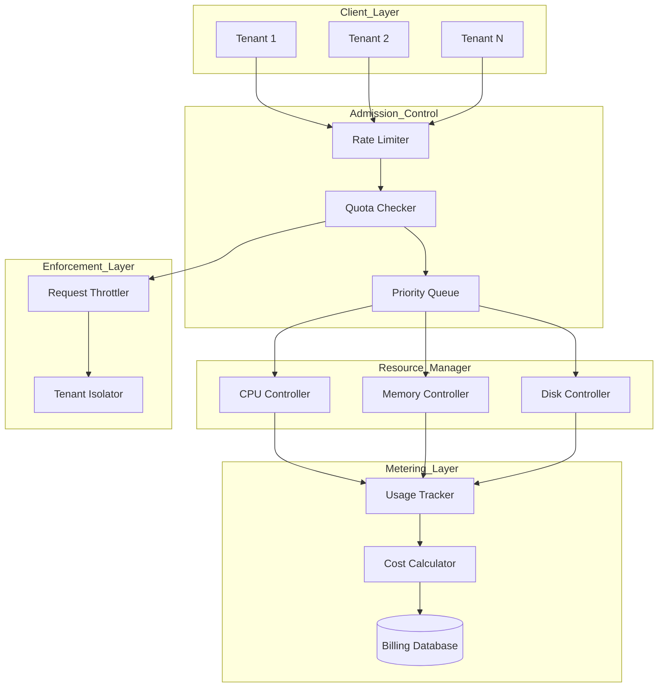

# RFC 010: Resource Quotas & Quality of Service

**Status:** Draft  
**Created:** 2025-11-16  
**Authors:** Meilisearch Community  
**Tracking Issue:** TBD

---

## Summary

This RFC proposes a comprehensive resource quota and quality of service (QoS) system for multi-tenant Meilisearch deployments, enabling per-tenant resource limits (CPU, memory, disk, API rate), priority queues for different service tiers, cost attribution and billing metrics, and tenant isolation guarantees. These features enable SaaS providers to offer Meilisearch as a managed service with predictable performance and resource usage.

## Motivation

### Current Limitations

From [`RESEARCH_PLAN.md`](RESEARCH_PLAN.md:524), resource quotas are identified as an enterprise feature need:

**Current State:**
- ❌ **No per-tenant limits**: Single tenant can exhaust resources
- ❌ **No rate limiting**: API can be overwhelmed
- ❌ **No priority queues**: All requests treated equally
- ❌ **No cost attribution**: Cannot track resource usage per tenant

From [`blog_posts/07_advanced_patterns_production_search.md`](blog_posts/07_advanced_patterns_production_search.md:1616), multi-tenancy patterns exist but lack enforcement:

**Current Multi-Tenancy:**
```rust
// Tenant isolation via API keys
let tenant_key = client.create_key(KeyBuilder::new()
    .with_search_rules(json!({
        "shared_index": {
            "filter": "tenant_id = tenant-abc"
        }
    }))
).await?;

// Issue: No resource limits enforced
```

### Real-World Use Cases

**Multi-Tenant SaaS Platform:**
- 10,000+ tenants on shared infrastructure
- **Problem:** One tenant's large import blocks others
- **Solution:** Per-tenant CPU/memory quotas

**Tiered Service Offering:**
- Free tier: 1K searches/day, 10K documents
- Pro tier: 100K searches/day, 1M documents
- Enterprise: Custom limits
- **Problem:** Cannot enforce tier limits
- **Solution:** QoS with priority queues

**Cost Attribution:**
- Cloud provider billing customers
- **Problem:** Cannot attribute costs per tenant
- **Solution:** Track resource usage metrics

**Abuse Prevention:**
- Prevent malicious/misconfigured clients
- **Problem:** No rate limiting
- **Solution:** Adaptive rate limiting

## Technical Design

### Architecture Overview



### 1. Tenant Resource Quotas

**New file:** `crates/meilisearch-quota/src/tenant_quotas.rs`

```rust
use std::collections::HashMap;
use std::sync::Arc;

#[derive(Debug, Clone, Serialize, Deserialize)]
pub struct TenantQuota {
    /// Tenant identifier
    pub tenant_id: String,
    
    /// Service tier
    pub tier: ServiceTier,
    
    /// Resource limits
    pub limits: ResourceLimits,
    
    /// Current usage
    pub usage: ResourceUsage,
    
    /// Soft vs hard limits
    pub enforcement: EnforcementPolicy,
}

#[derive(Debug, Clone, Serialize, Deserialize)]
pub enum ServiceTier {
    Free,
    Hobby,
    Pro,
    Enterprise,
    Custom(String),
}

#[derive(Debug, Clone, Serialize, Deserialize)]
pub struct ResourceLimits {
    /// Maximum documents across all indexes
    pub max_documents: Option<usize>,
    
    /// Maximum total index size (bytes)
    pub max_index_size: Option<u64>,
    
    /// Maximum number of indexes
    pub max_indexes: Option<usize>,
    
    /// API rate limits
    pub rate_limits: RateLimits,
    
    /// Maximum concurrent searches
    pub max_concurrent_searches: Option<usize>,
    
    /// Maximum indexing operations per day
    pub max_indexing_ops_per_day: Option<usize>,
    
    /// CPU quota (milliseconds per second)
    pub cpu_quota_ms: Option<u64>,
    
    /// Memory limit (bytes)
    pub memory_limit: Option<u64>,
}

#[derive(Debug, Clone, Serialize, Deserialize)]
pub struct RateLimits {
    /// Searches per minute
    pub searches_per_minute: Option<u32>,
    
    /// Document additions per minute
    pub documents_per_minute: Option<u32>,
    
    /// Settings updates per hour
    pub settings_per_hour: Option<u32>,
    
    /// Burst allowance (extra capacity for short periods)
    pub burst_capacity: Option<u32>,
}

#[derive(Debug, Default, Clone, Serialize, Deserialize)]
pub struct ResourceUsage {
    /// Current document count
    pub document_count: usize,
    
    /// Current index size (bytes)
    pub index_size: u64,
    
    /// Number of indexes
    pub index_count: usize,
    
    /// API calls in current window
    pub api_calls: HashMap<ApiOperation, u32>,
    
    /// CPU time used (milliseconds)
    pub cpu_time_ms: u64,
    
    /// Memory currently allocated
    pub memory_allocated: u64,
    
    /// Last reset time
    pub last_reset: i64,
}

#[derive(Debug, Clone, Copy, PartialEq, Eq, Hash, Serialize, Deserialize)]
pub enum ApiOperation {
    Search,
    DocumentAdd,
    SettingsUpdate,
    IndexCreate,
}

#[derive(Debug, Clone, Serialize, Deserialize)]
pub enum EnforcementPolicy {
    /// Block requests immediately when limit reached
    Hard,
    /// Allow burst up to N% over limit, then throttle
    Soft { burst_percent: u32 },
    /// Warn but don't enforce
    Monitor,
}

pub struct QuotaManager {
    quotas: Arc<RwLock<HashMap<String, TenantQuota>>>,
    storage: Arc<QuotaStorage>,
}

impl QuotaManager {
    pub fn check_quota(
        &self,
        tenant_id: &str,
        operation: ApiOperation,
        estimated_cost: ResourceCost,
    ) -> Result<QuotaCheckResult> {
        let mut quotas = self.quotas.write().unwrap();
        let quota = quotas.get_mut(tenant_id)
            .ok_or(Error::TenantNotFound)?;
        
        // Check each limit
        let mut violations = Vec::new();
        
        // 1. Check document count
        if let Some(max_docs) = quota.limits.max_documents {
            if quota.usage.document_count + estimated_cost.documents > max_docs {
                violations.push(QuotaViolation::DocumentLimit {
                    current: quota.usage.document_count,
                    requested: estimated_cost.documents,
                    limit: max_docs,
                });
            }
        }
        
        // 2. Check rate limits
        if let Some(limit) = quota.limits.rate_limits.get_limit_for(operation) {
            let current_rate = quota.usage.api_calls.get(&operation).copied().unwrap_or(0);
            
            if current_rate >= limit {
                match quota.enforcement {
                    EnforcementPolicy::Hard => {
                        return Ok(QuotaCheckResult::Denied {
                            reason: QuotaViolation::RateLimit {
                                operation,
                                current: current_rate,
                                limit,
                            },
                        });
                    }
                    EnforcementPolicy::Soft { burst_percent } => {
                        let burst_limit = limit + (limit * burst_percent / 100);
                        if current_rate >= burst_limit {
                            return Ok(QuotaCheckResult::Denied {
                                reason: QuotaViolation::RateLimit {
                                    operation,
                                    current: current_rate,
                                    limit: burst_limit,
                                },
                            });
                        }
                        violations.push(QuotaViolation::SoftLimitExceeded {
                            operation,
                            current: current_rate,
                            soft_limit: limit,
                        });
                    }
                    EnforcementPolicy::Monitor => {
                        // Just log, don't block
                        tracing::warn!(
                            tenant_id = tenant_id,
                            operation = ?operation,
                            current = current_rate,
                            limit = limit,
                            "Tenant exceeded quota (monitor mode)"
                        );
                    }
                }
            }
        }
        
        // If no violations or only soft limit warnings
        if violations.iter().all(|v| matches!(v, QuotaViolation::SoftLimitExceeded { .. })) {
            Ok(QuotaCheckResult::Allowed {
                warnings: violations,
            })
        } else {
            Ok(QuotaCheckResult::Denied {
                reason: violations.into_iter().next().unwrap(),
            })
        }
    }
    
    pub fn record_usage(
        &self,
        tenant_id: &str,
        operation: ApiOperation,
        actual_cost: ResourceCost,
    ) -> Result<()> {
        let mut quotas = self.quotas.write().unwrap();
        let quota = quotas.get_mut(tenant_id)
            .ok_or(Error::TenantNotFound)?;
        
        // Update usage counters
        quota.usage.document_count += actual_cost.documents;
        quota.usage.cpu_time_ms += actual_cost.cpu_time_ms;
        quota.usage.memory_allocated = quota.usage.memory_allocated.max(actual_cost.memory_bytes);
        
        *quota.usage.api_calls.entry(operation).or_insert(0) += 1;
        
        // Persist to storage
        self.storage.update_usage(tenant_id, &quota.usage)?;
        
        Ok(())
    }
}

#[derive(Debug)]
pub enum QuotaCheckResult {
    Allowed {
        warnings: Vec<QuotaViolation>,
    },
    Denied {
        reason: QuotaViolation,
    },
}

#[derive(Debug, Serialize)]
pub enum QuotaViolation {
    DocumentLimit {
        current: usize,
        requested: usize,
        limit: usize,
    },
    RateLimit {
        operation: ApiOperation,
        current: u32,
        limit: u32,
    },
    SoftLimitExceeded {
        operation: ApiOperation,
        current: u32,
        soft_limit: u32,
    },
    MemoryLimit {
        current: u64,
        requested: u64,
        limit: u64,
    },
}

#[derive(Debug, Default)]
pub struct ResourceCost {
    pub documents: usize,
    pub cpu_time_ms: u64,
    pub memory_bytes: u64,
}
```

### 2. Token Bucket Rate Limiter

**New file:** `crates/meilisearch-quota/src/rate_limiter.rs`

```rust
use std::time::{Duration, Instant};

/// Token bucket rate limiter
pub struct TokenBucketRateLimiter {
    /// Maximum tokens (burst capacity)
    capacity: u32,
    /// Tokens added per second
    refill_rate: f64,
    /// Current token count
    tokens: f64,
    /// Last refill time
    last_refill: Instant,
}

impl TokenBucketRateLimiter {
    pub fn new(rate_per_minute: u32, burst_capacity: Option<u32>) -> Self {
        let capacity = burst_capacity.unwrap_or(rate_per_minute);
        let refill_rate = rate_per_minute as f64 / 60.0; // tokens per second
        
        Self {
            capacity,
            refill_rate,
            tokens: capacity as f64,
            last_refill: Instant::now(),
        }
    }
    
    /// Try to consume N tokens
    pub fn try_consume(&mut self, tokens: u32) -> bool {
        self.refill();
        
        if self.tokens >= tokens as f64 {
            self.tokens -= tokens as f64;
            true
        } else {
            false
        }
    }
    
    /// Refill tokens based on elapsed time
    fn refill(&mut self) {
        let now = Instant::now();
        let elapsed = now.duration_since(self.last_refill).as_secs_f64();
        
        let tokens_to_add = elapsed * self.refill_rate;
        self.tokens = (self.tokens + tokens_to_add).min(self.capacity as f64);
        self.last_refill = now;
    }
    
    /// Time until N tokens available
    pub fn time_until_available(&self, tokens: u32) -> Option<Duration> {
        if self.tokens >= tokens as f64 {
            return None;
        }
        
        let tokens_needed = tokens as f64 - self.tokens;
        let seconds = tokens_needed / self.refill_rate;
        
        Some(Duration::from_secs_f64(seconds))
    }
}

/// Per-tenant rate limiter manager
pub struct TenantRateLimiter {
    limiters: Arc<RwLock<HashMap<String, HashMap<ApiOperation, TokenBucketRateLimiter>>>>,
}

impl TenantRateLimiter {
    pub fn check_rate_limit(
        &self,
        tenant_id: &str,
        operation: ApiOperation,
        quota: &TenantQuota,
    ) -> Result<RateLimitResult> {
        let mut limiters = self.limiters.write().unwrap();
        let tenant_limiters = limiters.entry(tenant_id.to_string())
            .or_insert_with(HashMap::new);
        
        let limiter = tenant_limiters.entry(operation)
            .or_insert_with(|| {
                let limit = quota.limits.rate_limits.get_limit_for(operation).unwrap_or(1000);
                let burst = quota.limits.rate_limits.burst_capacity.unwrap_or(limit * 2);
                TokenBucketRateLimiter::new(limit, Some(burst))
            });
        
        if limiter.try_consume(1) {
            Ok(RateLimitResult::Allowed {
                remaining: limiter.tokens as u32,
            })
        } else {
            let retry_after = limiter.time_until_available(1)
                .unwrap_or(Duration::from_secs(60));
            
            Ok(RateLimitResult::Limited {
                retry_after,
            })
        }
    }
}

#[derive(Debug)]
pub enum RateLimitResult {
    Allowed { remaining: u32 },
    Limited { retry_after: Duration },
}
```

### 3. Priority Queue System

**New file:** `crates/meilisearch-quota/src/priority_queue.rs`

```rust
use std::collections::BinaryHeap;
use std::cmp::Ordering;

#[derive(Debug, Clone, Copy, PartialEq, Eq, PartialOrd, Ord)]
pub enum Priority {
    Low = 0,
    Normal = 1,
    High = 2,
    Critical = 3,
}

impl From<ServiceTier> for Priority {
    fn from(tier: ServiceTier) -> Self {
        match tier {
            ServiceTier::Free => Priority::Low,
            ServiceTier::Hobby => Priority::Normal,
            ServiceTier::Pro => Priority::High,
            ServiceTier::Enterprise => Priority::Critical,
            ServiceTier::Custom(_) => Priority::Normal,
        }
    }
}

#[derive(Debug)]
pub struct PrioritizedRequest {
    pub request_id: String,
    pub tenant_id: String,
    pub priority: Priority,
    pub enqueued_at: Instant,
    pub operation: ApiOperation,
    pub payload: RequestPayload,
}

impl PartialEq for PrioritizedRequest {
    fn eq(&self, other: &Self) -> bool {
        self.request_id == other.request_id
    }
}

impl Eq for PrioritizedRequest {}

impl PartialOrd for PrioritizedRequest {
    fn partial_cmp(&self, other: &Self) -> Option<Ordering> {
        Some(self.cmp(other))
    }
}

impl Ord for PrioritizedRequest {
    fn cmp(&self, other: &Self) -> Ordering {
        // Higher priority first
        match self.priority.cmp(&other.priority) {
            Ordering::Equal => {
                // FIFO within same priority
                self.enqueued_at.cmp(&other.enqueued_at).reverse()
            }
            other => other.reverse(),
        }
    }
}

pub struct PriorityQueueManager {
    queue: Arc<Mutex<BinaryHeap<PrioritizedRequest>>>,
    max_queue_size: usize,
}

impl PriorityQueueManager {
    pub fn enqueue(&self, request: PrioritizedRequest) -> Result<()> {
        let mut queue = self.queue.lock().unwrap();
        
        if queue.len() >= self.max_queue_size {
            // Queue full - reject lowest priority requests
            if let Some(lowest) = queue.peek() {
                if request.priority <= lowest.priority {
                    return Err(Error::QueueFull);
                }
                queue.pop(); // Remove lowest priority
            }
        }
        
        queue.push(request);
        Ok(())
    }
    
    pub fn dequeue(&self) -> Option<PrioritizedRequest> {
        let mut queue = self.queue.lock().unwrap();
        queue.pop()
    }
}
```

### 4. Resource Usage Tracking

**New file:** `crates/meilisearch-quota/src/usage_tracker.rs`

```rust
pub struct UsageTracker {
    /// Per-tenant metrics
    metrics: Arc<RwLock<HashMap<String, TenantMetrics>>>,
    /// Metrics storage
    storage: Arc<MetricsStorage>,
}

#[derive(Default, Clone, Serialize, Deserialize)]
pub struct TenantMetrics {
    /// API call counts by operation
    pub api_calls: HashMap<ApiOperation, u64>,
    
    /// Total documents indexed
    pub documents_indexed: u64,
    
    /// Total documents deleted
    pub documents_deleted: u64,
    
    /// Total searches performed
    pub searches_performed: u64,
    
    /// CPU time consumed (milliseconds)
    pub cpu_time_ms: u64,
    
    /// Peak memory usage
    pub peak_memory_bytes: u64,
    
    /// Disk space used
    pub disk_space_bytes: u64,
    
    /// Network bandwidth (ingress + egress)
    pub network_bytes: u64,
    
    /// Time period these metrics cover
    pub period_start: i64,
    pub period_end: i64,
}

impl UsageTracker {
    pub fn record_operation(
        &self,
        tenant_id: &str,
        operation: ApiOperation,
        cost: ResourceCost,
    ) -> Result<()> {
        let mut metrics = self.metrics.write().unwrap();
        let tenant_metrics = metrics.entry(tenant_id.to_string())
            .or_default();
        
        // Update counters
        *tenant_metrics.api_calls.entry(operation).or_insert(0) += 1;
        
        match operation {
            ApiOperation::DocumentAdd => {
                tenant_metrics.documents_indexed += cost.documents as u64;
            }
            ApiOperation::Search => {
                tenant_metrics.searches_performed += 1;
            }
            _ => {}
        }
        
        tenant_metrics.cpu_time_ms += cost.cpu_time_ms;
        tenant_metrics.peak_memory_bytes = tenant_metrics.peak_memory_bytes.max(cost.memory_bytes);
        
        Ok(())
    }
    
    pub fn get_metrics(&self, tenant_id: &str, period: TimePeriod) -> Result<TenantMetrics> {
        // Retrieve metrics for time period
        self.storage.get_metrics(tenant_id, period)
    }
    
    pub fn reset_metrics(&self, tenant_id: &str) -> Result<()> {
        let mut metrics = self.metrics.write().unwrap();
        metrics.remove(tenant_id);
        Ok(())
    }
}
```

### 5. Cost Calculator

**New file:** `crates/meilisearch-quota/src/billing.rs`

```rust
pub struct CostCalculator {
    pricing: Arc<RwLock<PricingModel>>,
}

#[derive(Clone, Serialize, Deserialize)]
pub struct PricingModel {
    /// Cost per 1000 searches
    pub search_cost_per_k: f64,
    
    /// Cost per 1000 documents indexed
    pub indexing_cost_per_k: f64,
    
    /// Cost per GB-month storage
    pub storage_cost_per_gb_month: f64,
    
    /// Cost per CPU-hour
    pub cpu_cost_per_hour: f64,
    
    /// Cost per GB network egress
    pub network_cost_per_gb: f64,
}

impl Default for PricingModel {
    fn default() -> Self {
        Self {
            search_cost_per_k: 0.50,        // $0.50 per 1K searches
            indexing_cost_per_k: 1.00,      // $1.00 per 1K documents
            storage_cost_per_gb_month: 0.10, // $0.10 per GB-month
            cpu_cost_per_hour: 0.05,        // $0.05 per CPU-hour
            network_cost_per_gb: 0.09,      // $0.09 per GB egress
        }
    }
}

impl CostCalculator {
    pub fn calculate_cost(&self, metrics: &TenantMetrics) -> BillingReport {
        let pricing = self.pricing.read().unwrap();
        
        let search_cost = (metrics.searches_performed as f64 / 1000.0) * pricing.search_cost_per_k;
        let indexing_cost = (metrics.documents_indexed as f64 / 1000.0) * pricing.indexing_cost_per_k;
        
        let storage_gb_months = metrics.disk_space_bytes as f64 / (1024.0 * 1024.0 * 1024.0);
        let storage_cost = storage_gb_months * pricing.storage_cost_per_gb_month;
        
        let cpu_hours = metrics.cpu_time_ms as f64 / (1000.0 * 3600.0);
        let cpu_cost = cpu_hours * pricing.cpu_cost_per_hour;
        
        let network_gb = metrics.network_bytes as f64 / (1024.0 * 1024.0 * 1024.0);
        let network_cost = network_gb * pricing.network_cost_per_gb;
        
        let total_cost = search_cost + indexing_cost + storage_cost + cpu_cost + network_cost;
        
        BillingReport {
            tenant_id: \"<tenant>\".to_string(), // Fill from metrics
            period_start: metrics.period_start,
            period_end: metrics.period_end,
            breakdown: CostBreakdown {
                search_cost,
                indexing_cost,
                storage_cost,
                cpu_cost,
                network_cost,
            },
            total_cost,
            currency: \"USD\".to_string(),
        }
    }
}

#[derive(Debug, Serialize)]
pub struct BillingReport {
    pub tenant_id: String,
    pub period_start: i64,
    pub period_end: i64,
    pub breakdown: CostBreakdown,
    pub total_cost: f64,
    pub currency: String,
}

#[derive(Debug, Serialize)]
pub struct CostBreakdown {
    pub search_cost: f64,
    pub indexing_cost: f64,
    pub storage_cost: f64,
    pub cpu_cost: f64,
    pub network_cost: f64,
}
```

## API Changes

### Quota Management API

```http
# Set tenant quotas
PUT /tenants/{tenantId}/quotas

{
  "tier": "pro",
  "limits": {
    "maxDocuments": 1000000,
    "maxIndexSize": 10737418240,
    "maxIndexes": 10,
    "rateLimits": {
      "searchesPerMinute": 1000,
      "documentsPerMinute": 10000,
      "burstCapacity": 2000
    },
    "maxConcurrentSearches": 50,
    "cpuQuotaMs": 500,
    "memoryLimit": 2147483648
  },
  "enforcement": {
    "type": "soft",
    "burstPercent": 20
  }
}

# Get tenant usage
GET /tenants/{tenantId}/usage?period=current_month

Response:
{
  "tenantId": "tenant-abc",
  "tier": "pro",
  "usage": {
    "documentCount": 450000,
    "indexSize": 5368709120,
    "indexCount": 5,
    "apiCalls": {
      "search": 85000,
      "documentAdd": 12000,
      "settingsUpdate": 45
    },
    "cpuTimeMs": 3600000,
    "memoryAllocated": 1610612736
  },
  "limits": {
    "maxDocuments": 1000000,
    "searchesPerMinute": 1000
  },
  "utilizationPercent": {
    "documents": 45.0,
    "indexSize": 50.0,
    "searches": 8.5
  }
}

# Get billing report
GET /tenants/{tenantId}/billing?start=2025-11-01&end=2025-11-30

Response:
{
  "tenantId": "tenant-abc",
  "periodStart": "2025-11-01T00:00:00Z",
  "periodEnd": "2025-11-30T23:59:59Z",
  "breakdown": {
    "searchCost": 42.50,
    "indexingCost": 12.00,
    "storageCost": 0.50,
    "cpuCost": 5.00,
    "networkCost": 0.90
  },
  "totalCost": 60.90,
  "currency": "USD"
}
```

### Rate Limit Headers

```http
HTTP/1.1 200 OK
X-RateLimit-Limit: 1000
X-RateLimit-Remaining: 745
X-RateLimit-Reset: 1699564860

# When rate limited:
HTTP/1.1 429 Too Many Requests
Retry-After: 42
X-RateLimit-Limit: 1000
X-RateLimit-Remaining: 0
X-RateLimit-Reset: 1699564860

{
  "message": "Rate limit exceeded",
  "code": "rate_limit_exceeded",
  "details": {
    "limit": 1000,
    "window": "per_minute",
    "retryAfter": 42
  }
}
```

## Backward Compatibility

### Compatibility Strategy

1. **Disabled by default**: Quotas not enforced unless configured
2. **Opt-in per tenant**: Enable quotas incrementally
3. **Graceful degradation**: If quota system fails, allow requests
4. **No breaking changes**: Existing APIs unchanged

## Implementation Plan

### Phase 1: Core Quota System (3 weeks)

**Tasks:**
1. Implement TenantQuota data structures
2. Add QuotaManager
3. Create quota storage backend
4. Unit tests

**Deliverables:**
- Quota checking functional
- Storage working
- API for quota management

### Phase 2: Rate Limiting (2 weeks)

**Tasks:**
1. Implement token bucket rate limiter
2. Add per-operation limits
3. Integration with HTTP middleware
4. Test under load

**Deliverables:**
- Rate limiting working
- Proper HTTP headers
- Load test results

### Phase 3: Priority Queues (3 weeks)

**Tasks:**
1. Implement priority queue
2. Request scheduling logic
3. Fairness guarantees
4. Performance tuning

**Deliverables:**
- Priority-based scheduling
- Starvation prevention
- Benchmarks

### Phase 4: Usage Tracking & Billing (3 weeks)

**Tasks:**
1. Implement usage tracker
2. Add cost calculator
3. Billing report generation
4. Export functionality

**Deliverables:**
- Accurate usage tracking
- Cost reports
- Billing API

### Phase 5: Testing & Documentation (2 weeks)

**Tasks:**
1. Multi-tenant load testing
2. Quota enforcement validation
3. Documentation
4. Migration guide

**Deliverables:**
- Complete test suite
- Admin guide
- API documentation

## Performance Implications

### Overhead per Request

**Quota check:**
```
Lookup tenant quota: 0.1ms
Check limits: 0.05ms
Rate limit check: 0.05ms
Priority assignment: 0.02ms
Total: ~0.2ms overhead
```

**Acceptable:** < 2% for typical 15ms query

### Storage Requirements

**Per tenant:**
```
Quota configuration: 1KB
Usage metrics (monthly): 5KB
Historical data (1 year): 60KB
Total per 1000 tenants: ~66MB
```

## Drawbacks

### 1. Additional Complexity

Resource quotas add configuration and operational complexity

**Mitigation:** Smart defaults, optional feature

### 2. Performance Overhead

Quota checking adds 0.2ms per request

**Mitigation:** Caching, async updates

### 3. Potential for Misconfiguration

Incorrect limits can block legitimate usage

**Mitigation:** Monitoring, alerts, admin tools

## Alternatives Considered

### 1. Application-Level Quotas

**Approach:** Implement quotas in application layer

**Why not chosen:**
- Every user would re-implement
- Inconsistent across deployments
- Better as native feature

### 2. Reverse Proxy Rate Limiting

**Approach:** Use nginx/HAProxy for rate limiting

**Why not chosen:**
- No tenant-aware resource tracking
- Cannot limit documents, disk, etc.
- Coarse-grained only

### 3. Kubernetes Resource Quotas

**Approach:** Use K8s native quotas

**Why not chosen:**
- Requires Kubernetes
- Pod-level, not tenant-level
- Meilisearch single-node doesn't map well

## Open Questions

### 1. Fair Scheduling Algorithm

**Question:** How to ensure fairness across priorities?

**Options:**
- A: Strict priority (high always first)
- B: Weighted fair queueing
- C: Deficit round-robin

**Recommendation:** Option B

### 2. Quota Reset Schedule

**Question:** When to reset rate limit counters?

**Options:**
- A: Fixed intervals (top of hour)
- B: Rolling windows
- C: Sliding windows

**Recommendation:** Option B (token bucket naturally rolling)

### 3. Overuse Handling

**Question:** What happens when soft limit exceeded?

**Options:**
- A: Throttle gradually
- B: Notify tenant
- C: Upgrade prompt

**Recommendation:** All three (progressive response)

## References

### Resource Management Research

1. **Fair Scheduling:**
   - Shreedhar, M., & Varghese, G. (1996). \"Efficient Fair Queuing Using Deficit Round-Robin.\" *SIGCOMM*.

2. **Rate Limiting:**
   - Token Bucket Algorithm (classic)
   - [Wikipedia](https://en.wikipedia.org/wiki/Token_bucket)

### Existing Implementations

1. **AWS Service Quotas:**
   - [Documentation](https://docs.aws.amazon.com/servicequotas/)

2. **Stripe API Rate Limiting:**
   - [Documentation](https://stripe.com/docs/rate-limits)

### Meilisearch Codebase

1. **Current auth:** [`crates/meilisearch/src/extractors/authentication/mod.rs`](crates/meilisearch/src/extractors/authentication/mod.rs:1)
2. **API keys:** [`crates/meilisearch-types/src/keys.rs`](crates/meilisearch-types/src/keys.rs:28)

## Community Discussion

Key discussion points:

1. **Target users:** How many need multi-tenancy quotas?
2. **Pricing models:** What pricing makes sense?
3. **Enforcement strictness:** Hard vs soft limits default?
4. **Billing integration:** Support for payment providers?

**Discussion link:** TBD after posting to GitHub

---

**Changelog:**
- 2025-11-16: Initial draft created