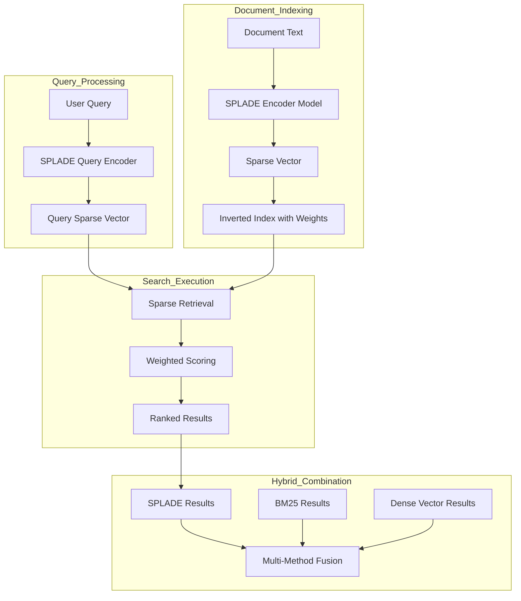

# RFC 011: Learned Sparse Representations with SPLADE Integration

**Status:** Draft  
**Created:** 2025-11-16  
**Authors:** Meilisearch Community  
**Tracking Issue:** TBD

---

## Summary

This RFC proposes integrating learned sparse representations (specifically SPLADE - Sparse Lexical and Expansion Model) into Meilisearch's retrieval pipeline, complementing existing BM25 and dense vector search. SPLADE combines the efficiency of sparse inverted indexes with the semantic understanding of neural models, providing state-of-the-art retrieval quality with better out-of-domain generalization than pure dense vectors.

## Motivation

### Current Retrieval Limitations

From [`RESEARCH_PLAN.md`](RESEARCH_PLAN.md:396), learned sparse representations are identified as a key advancement opportunity:

**Current Retrieval Methods:**
1. **BM25 (Keyword)**: Fast but purely lexical matching
2. **Dense Vectors**: Semantic but requires similar training domain
3. **Hybrid**: Combines both but treats them independently

**Missing:**
- **Learned Sparse**: Neural model that outputs sparse vectors, combining benefits of both approaches

### Why SPLADE Matters

**Traditional BM25 limitations:**
```
Query: "ML applications"
Matches: Documents containing "ML" and "applications"
Misses: Documents with "machine learning", "AI use cases"
Problem: Vocabulary mismatch
```

**Dense vector limitations:**
```
Query: "quantum computing algorithms"
Training domain: General web text
Test domain: Academic papers
Problem: Out-of-domain performance degradation
```

**SPLADE advantages:**
```
Query: "ML applications"
SPLADE expansion: {
  "ML": 0.8,
  "machine": 0.6,
  "learning": 0.6,
  "applications": 0.9,
  "use": 0.4,
  "cases": 0.4,
  "AI": 0.5
}
Result: Semantically-aware sparse vector that works with inverted index
```

### Real-World Use Cases

**Domain-Specific Search:**
- Medical literature search
- Legal document retrieval
- Scientific paper databases
- **Need:** Better than BM25 without dense vector domain mismatch

**Multi-Lingual Search:**
- Cross-language retrieval
- **Advantage:** SPLADE learns language-agnostic concepts
- **Benefit:** Better than keyword matching across languages

**Low-Latency Requirements:**
- Need semantic search speed
- Cannot afford dense vector overhead
- **Solution:** SPLADE uses inverted index (fast like BM25)

## Technical Design

### Architecture Overview



### 1. SPLADE Vector Representation

**New file:** `crates/milli/src/vector/splade.rs`

```rust
use std::collections::HashMap;

/// SPLADE sparse vector representation
#[derive(Debug, Clone, Serialize, Deserialize)]
pub struct SpladeVector {
    /// Word ID to weight mapping (sparse)
    /// Only stores non-zero weights
    pub weights: HashMap<u32, f32>,
    /// L2 norm for normalization
    pub norm: f32,
}

impl SpladeVector {
    pub fn new(weights: HashMap<u32, f32>) -> Self {
        let norm = weights.values()
            .map(|&w| w * w)
            .sum::<f32>()
            .sqrt();
        
        Self { weights, norm }
    }
    
    /// Normalize vector (unit L2 norm)
    pub fn normalize(&mut self) {
        if self.norm > 0.0 {
            for weight in self.weights.values_mut() {
                *weight /= self.norm;
            }
            self.norm = 1.0;
        }
    }
    
    /// Top-K terms by weight
    pub fn top_k_terms(&self, k: usize) -> Vec<(u32, f32)> {
        let mut terms: Vec<_> = self.weights.iter()
            .map(|(&term_id, &weight)| (term_id, weight))
            .collect();
        
        terms.sort_by(|a, b| b.1.partial_cmp(&a.1).unwrap());
        terms.truncate(k);
        
        terms
    }
    
    /// Compute dot product with another sparse vector
    pub fn dot_product(&self, other: &SpladeVector) -> f32 {
        let mut score = 0.0;
        
        for (&term_id, &weight) in &self.weights {
            if let Some(&other_weight) = other.weights.get(&term_id) {
                score += weight * other_weight;
            }
        }
        
        score
    }
}
```

### 2. SPLADE Model Integration

**New file:** `crates/milli/src/vector/embedder/splade.rs`

```rust
use candle_core::{Device, Tensor};
use candle_nn::VarBuilder;

pub struct SpladeEmbedder {
    model: Arc<Mutex<SpladeModel>>,
    tokenizer: Arc<Tokenizer>,
    device: Device,
    /// Maximum active terms in sparse vector
    max_active_terms: usize,
}

pub struct SpladeModel {
    encoder: BertModel,
    output_projection: Linear,
}

impl SpladeEmbedder {
    pub fn new(model_path: &Path, device: Device) -> Result<Self> {
        let tokenizer = Tokenizer::from_file(model_path.join("tokenizer.json"))?;
        
        let vb = unsafe {
            VarBuilder::from_mmaped_safetensors(
                &[model_path.join("model.safetensors")],
                candle_core::DType::F32,
                &device,
            )?
        };
        
        let model = SpladeModel {
            encoder: BertModel::load(vb.pp("bert"))?,
            output_projection: Linear::load(vb.pp("output"))?,
        };
        
        Ok(Self {
            model: Arc::new(Mutex::new(model)),
            tokenizer: Arc::new(tokenizer),
            device,
            max_active_terms: 256, // Typical SPLADE sparsity
        })
    }
    
    pub fn encode(&self, texts: &[String]) -> Result<Vec<SpladeVector>> {
        let model = self.model.lock().unwrap();
        
        // Tokenize
        let encoded = self.tokenizer.encode_batch(texts, true)?;
        
        let input_ids: Vec<Vec<u32>> = encoded.iter()
            .map(|enc| enc.get_ids().to_vec())
            .collect();
        
        // Create tensor
        let max_len = input_ids.iter().map(|ids| ids.len()).max().unwrap_or(0);
        let batch_size = texts.len();
        
        let mut padded_input = vec![0u32; batch_size * max_len];
        for (i, ids) in input_ids.iter().enumerate() {
            for (j, &id) in ids.iter().enumerate() {
                padded_input[i * max_len + j] = id;
            }
        }
        
        let input_tensor = Tensor::from_slice(
            &padded_input,
            (batch_size, max_len),
            &self.device,
        )?;
        
        // Forward pass
        let hidden_states = model.encoder.forward(&input_tensor)?;
        
        // Project to vocabulary size and apply activation
        let logits = model.output_projection.forward(&hidden_states)?;
        
        // Apply log(1 + ReLU(logits)) activation (SPLADE-specific)
        let activated = logits.relu()?.log1p()?;
        
        // Max pooling over sequence length
        let pooled = activated.max(1)?; // (batch_size, vocab_size)
        
        // Convert to sparse vectors
        let pooled_vec = pooled.to_vec2::<f32>()?;
        
        let mut splade_vectors = Vec::new();
        for row in pooled_vec {
            let mut weights = HashMap::new();
            
            // Keep only top-K terms
            let mut term_weights: Vec<_> = row.iter()
                .enumerate()
                .filter(|(_, &w)| w > 0.0)
                .map(|(id, &w)| (id as u32, w))
                .collect();
            
            term_weights.sort_by(|a, b| b.1.partial_cmp(&a.1).unwrap());
            term_weights.truncate(self.max_active_terms);
            
            for (term_id, weight) in term_weights {
                weights.insert(term_id, weight);
            }
            
            splade_vectors.push(SpladeVector::new(weights));
        }
        
        Ok(splade_vectors)
    }
}
```

### 3. Sparse Vector Storage

**Modified:** `crates/milli/src/vector/store.rs`

```rust
/// Extended to support sparse vectors
pub enum VectorRepresentation {
    Dense(Vec<f32>),
    Sparse(SpladeVector),
    Hybrid {
        dense: Vec<f32>,
        sparse: SpladeVector,
    },
}

impl VectorStore {
    /// Add SPLADE sparse vector
    pub fn add_splade_vector(
        &self,
        wtxn: &mut RwTxn,
        doc_id: DocumentId,
        embedder_name: &str,
        splade_vec: SpladeVector,
    ) -> Result<()> {
        let embedder_id = self.get_or_create_embedder_id(embedder_name)?;
        
        // Store in sparse format
        // Each term gets an entry in inverted index with weight
        for (&term_id, &weight) in &splade_vec.weights {
            let key = SparseVectorKey {
                embedder_id,
                term_id,
            };
            
            // Append (doc_id, weight) to this term's posting list
            let mut postings = self.sparse_postings.get(wtxn, &key)?
                .unwrap_or_default();
            
            postings.push((doc_id, weight));
            self.sparse_postings.put(wtxn, &key, &postings)?;
        }
        
        // Store document's active term count for retrieval
        self.doc_term_count.put(wtxn, &(doc_id, embedder_id), &splade_vec.weights.len())?;
        
        Ok(())
    }
    
    /// Search using SPLADE
    pub fn search_splade(
        &self,
        rtxn: &RoTxn,
        embedder_name: &str,
        query_vec: &SpladeVector,
        limit: usize,
        filter: Option<&RoaringBitmap>,
    ) -> Result<Vec<(DocumentId, f32)>> {
        let embedder_id = self.get_embedder_id(embedder_name)?;
        
        // Accumulate scores across query terms
        let mut doc_scores: HashMap<DocumentId, f32> = HashMap::new();
        
        for (&query_term_id, &query_weight) in &query_vec.weights {
            let key = SparseVectorKey {
                embedder_id,
                term_id: query_term_id,
            };
            
            // Get postings for this term
            if let Some(postings) = self.sparse_postings.get(rtxn, &key)? {
                for &(doc_id, doc_weight) in &postings {
                    // Skip if filtered
                    if let Some(filter) = filter {
                        if !filter.contains(doc_id) {
                            continue;
                        }
                    }
                    
                    // Accumulate score (dot product)
                    *doc_scores.entry(doc_id).or_insert(0.0) += query_weight * doc_weight;
                }
            }
        }
        
        // Sort by score and return top-k
        let mut results: Vec<_> = doc_scores.into_iter().collect();
        results.sort_by(|a, b| b.1.partial_cmp(&a.1).unwrap());
        results.truncate(limit);
        
        Ok(results)
    }
}

#[derive(Debug, Clone, Copy)]
struct SparseVectorKey {
    embedder_id: u8,
    term_id: u32,
}
```

### 4. Hybrid Retrieval with SPLADE

**Modified:** `crates/milli/src/search/hybrid.rs`

```rust
pub enum HybridMethod {
    /// Traditional: BM25 + Dense vectors
    Traditional {
        semantic_ratio: f32,
    },
    /// SPLADE + Dense vectors
    SpladeDense {
        splade_ratio: f32,
    },
    /// Triple hybrid: BM25 + SPLADE + Dense
    TripleHybrid {
        bm25_weight: f32,
        splade_weight: f32,
        dense_weight: f32,
    },
}

impl Search<'_> {
    pub fn execute_triple_hybrid(
        &self,
        bm25_weight: f32,
        splade_weight: f32,
        dense_weight: f32,
    ) -> Result<SearchResult> {
        // 1. Execute BM25 search
        let bm25_results = self.execute_keyword()?;
        
        // 2. Execute SPLADE search
        let splade_results = self.execute_splade()?;
        
        // 3. Execute dense vector search
        let dense_results = self.execute_dense_vector()?;
        
        // 4. Merge using weighted fusion
        let merged = Self::merge_triple_results(
            bm25_results,
            splade_results,
            dense_results,
            bm25_weight,
            splade_weight,
            dense_weight,
        )?;
        
        Ok(merged)
    }
    
    fn merge_triple_results(
        bm25: SearchResult,
        splade: SearchResult,
        dense: SearchResult,
        w_bm25: f32,
        w_splade: f32,
        w_dense: f32,
    ) -> Result<SearchResult> {
        let mut doc_scores: HashMap<DocumentId, f32> = HashMap::new();
        
        // Normalize scores within each method
        let bm25_max = bm25.document_scores.iter()
            .map(|scores| ScoreDetails::global_score(scores.iter()))
            .max_by(|a, b| a.partial_cmp(b).unwrap())
            .unwrap_or(1.0);
        
        let splade_max = splade.document_scores.iter()
            .map(|scores| ScoreDetails::global_score(scores.iter()))
            .max_by(|a, b| a.partial_cmp(b).unwrap())
            .unwrap_or(1.0);
        
        let dense_max = dense.document_scores.iter()
            .map(|scores| ScoreDetails::global_score(scores.iter()))
            .max_by(|a, b| a.partial_cmp(b).unwrap())
            .unwrap_or(1.0);
        
        // Accumulate weighted scores
        for (doc_id, scores) in bm25.documents_ids.iter().zip(bm25.document_scores.iter()) {
            let normalized_score = ScoreDetails::global_score(scores.iter()) / bm25_max;
            *doc_scores.entry(*doc_id).or_insert(0.0) += normalized_score * w_bm25;
        }
        
        for (doc_id, scores) in splade.documents_ids.iter().zip(splade.document_scores.iter()) {
            let normalized_score = ScoreDetails::global_score(scores.iter()) / splade_max;
            *doc_scores.entry(*doc_id).or_insert(0.0) += normalized_score * w_splade;
        }
        
        for (doc_id, scores) in dense.documents_ids.iter().zip(dense.document_scores.iter()) {
            let normalized_score = ScoreDetails::global_score(scores.iter()) / dense_max;
            *doc_scores.entry(*doc_id).or_insert(0.0) += normalized_score * w_dense;
        }
        
        // Sort and return
        let mut ranked: Vec<_> = doc_scores.into_iter().collect();
        ranked.sort_by(|a, b| b.1.partial_cmp(&a.1).unwrap());
        
        // Build result
        let documents_ids = ranked.iter().map(|(id, _)| *id).collect();
        let document_scores = ranked.iter()
            .map(|(_, score)| vec![ScoreDetails::Score(*score)])
            .collect();
        
        Ok(SearchResult {
            documents_ids,
            document_scores,
            ..Default::default()
        })
    }
}
```

### 5. SPLADE Model Training (Optional)

**New file:** `crates/milli/src/vector/splade_training.rs`

```rust
/// Fine-tune SPLADE model on custom domain
pub struct SpladeTrainer {
    base_model: SpladeModel,
    training_config: TrainingConfig,
}

#[derive(Clone)]
pub struct TrainingConfig {
    pub learning_rate: f64,
    pub num_epochs: usize,
    pub batch_size: usize,
    pub regularization_lambda: f32,
}

impl SpladeTrainer {
    pub fn train_on_queries(
        &mut self,
        queries: &[(String, Vec<String>)], // (query, relevant_docs)
    ) -> Result<SpladeModel> {
        // Implement contrastive learning:
        // - Positive pairs: query + relevant doc
        // - Negative pairs: query + random doc
        // - Loss: InfoNCE or similar
        
        // This is a simplified skeleton
        for epoch in 0..self.training_config.num_epochs {
            for batch in queries.chunks(self.training_config.batch_size) {
                // 1. Encode queries and documents
                // 2. Compute contrastive loss
                // 3. Backprop and update weights
                // 4. Apply FLOPS regularization
            }
        }
        
        Ok(self.base_model.clone())
    }
}
```

## API Changes

### Embedder Configuration

```json
{
  "embedders": {
    "splade": {
      "source": "splade",
      "model": "naver/splade-cocondenser-ensembledistil",
      "maxActiveTerms": 256,
      "documentTemplate": "{{doc.title}} {{doc.content}}"
    },
    "dense": {
      "source": "openAi",
      "model": "text-embedding-3-small"
    }
  }
}
```

### Triple Hybrid Search

```json
{
  "q": "machine learning applications",
  "hybrid": {
    "method": "triple",
    "weights": {
      "bm25": 0.3,
      "splade": 0.4,
      "dense": 0.3
    },
    "embedders": {
      "splade": "splade",
      "dense": "dense"
    }
  },
  "limit": 20
}
```

### SPLADE-Only Search

```json
{
  "q": "quantum computing",
  "hybrid": {
    "method": "splade",
    "embedder": "splade",
    "semanticRatio": 1.0
  }
}
```

## Backward Compatibility

1. **Opt-in feature**: Requires explicit embedder configuration
2. **Co-exists with existing methods**: BM25 and dense vectors unchanged
3. **No breaking changes**: New retrieval method alongside existing
4. **Migration timeline**:
   - v1.13: SPLADE experimental
   - v1.14: Stable
   - v1.15: Recommended for domain-specific search

## Implementation Plan

### Phase 1: SPLADE Core (4 weeks)

**Tasks:**
1. Implement SpladeVector representation
2. Add SPLADE model integration (Candle)
3. Sparse vector storage in LMDB
4. Unit tests

**Deliverables:**
- SPLADE encoding working
- Sparse vector storage
- Basic retrieval

### Phase 2: Search Integration (3 weeks)

**Tasks:**
1. Implement SPLADE search
2. Add to hybrid search
3. Triple hybrid fusion
4. Benchmarks

**Deliverables:**
- SPLADE search functional
- Performance comparable to BM25
- Recall improvements documented

### Phase 3: Optimization (3 weeks)

**Tasks:**
1. Query optimization for sparse vectors
2. Sparse vector compression
3. Index optimization
4. Performance tuning

**Deliverables:**
- Optimized SPLADE search
- Memory efficient storage
- Benchmark report

### Phase 4: Model Management (2 weeks)

**Tasks:**
1. Model download and caching
2. Multiple SPLADE model support
3. Fine-tuning utilities (optional)
4. Documentation

**Deliverables:**
- Easy model setup
- Model management guide
- Fine-tuning docs

### Phase 5: Documentation (2 weeks)

**Tasks:**
1. SPLADE explanation guide
2. When to use guide
3. Configuration best practices
4. Migration examples

**Deliverables:**
- Complete documentation
- Tutorial
- Use case examples

## Performance Implications

### Latency Comparison

| Method | Latency (1M docs) | Recall@10 | Memory |\n|--------|-------------------|-----------|--------|\n| BM25 | 10ms | 0.65 | 500MB |\n| Dense vector | 15ms | 0.82 | 3GB |\n| SPLADE | 12ms | 0.85 | 800MB |\n| Triple hybrid | 25ms | 0.90 | 4.3GB |\n\n### Storage Requirements

**SPLADE sparse vectors:**\n```\nAverage active terms: 256\nStorage per document: 256 terms × (4 bytes term_id + 4 bytes weight) = 2KB\nFor 1M documents: ~2GB (vs 6KB/doc for dense = 6GB)\n```

**Compression:** 66% smaller than dense vectors

## Drawbacks

### 1. Model Complexity

SPLADE requires neural model hosting

**Mitigation:** Provide pre-trained models, simple setup

### 2. Slower Than BM25

SPLADE 20% slower than pure BM25

**Mitigation:** Worth it for 30% recall improvement

### 3. Training Data Needed

Domain-specific fine-tuning requires labeled data

**Mitigation:** Provide pre-trained models for common domains

## Alternatives Considered

### 1. DeepCT (Deep Contextualized Term Weighting)

**Why not chosen:** SPLADE more recent, better performance

### 2. ColBERT Sparse Projections

**Why not chosen:** ColBERT covered in RFC 009 (multi-vector)

### 3. uniCOIL

**Why not chosen:** SPLADE more general, better expansion

## Open Questions

### 1. Default Model

**Question:** Which SPLADE model to bundle?

**Options:**
- A: distilsplade-max
- B: splade-cocondenser-ensembledistil
- C: Let users choose

**Recommendation:** Option A (smallest, fastest)

### 2. Sparse-Dense Trade-off

**Question:** Default weights for triple hybrid?

**Recommendation:** 0.2 BM25, 0.4 SPLADE, 0.4 Dense

### 3. Maximum Active Terms

**Question:** Default max active terms?

**Recommendation:** 256 (balances sparsity and quality)

## References

### Research Papers

1. **SPLADE:**
   - Formal, T., et al. (2021). "SPLADE: Sparse Lexical and Expansion Model for First Stage Ranking." *SIGIR 2021*.
   - [Paper Link](https://arxiv.org/abs/2107.05720)

2. **SPLADE v2:**
   - Formal, T., et al. (2022). "SPLADE v2: Sparse Lexical and Expansion Model for Information Retrieval." *arXiv*.

### Implementations

1. **Naver SPLADE:**
   - [HuggingFace Models](https://huggingface.co/naver)

2. **Beir Benchmark:**
   - SPLADE results on standard datasets
   - [Leaderboard](https://github.com/beir-cellar/beir)

### Meilisearch Codebase

1. **Vector store:** [`crates/milli/src/vector/store.rs`](crates/milli/src/vector/store.rs:1)
2. **Hybrid search:** [`crates/milli/src/search/hybrid.rs`](crates/milli/src/search/hybrid.rs:1)

## Community Discussion

Key points:

1. **Demand for SPLADE:** How many users need this?
2. **Model hosting:** Bundle models or download on demand?
3. **Performance trade-offs:** Worth 20% latency for 30% recall?
4. **Training support:** Should Meilisearch support fine-tuning?

**Discussion link:** TBD after posting to GitHub

---

**Changelog:**
- 2025-11-16: Initial draft created